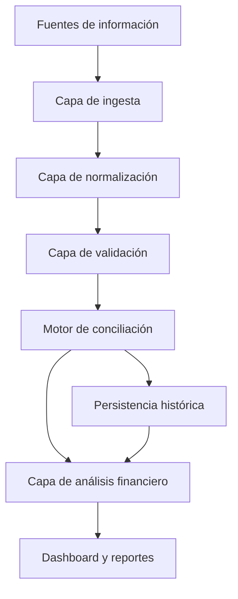
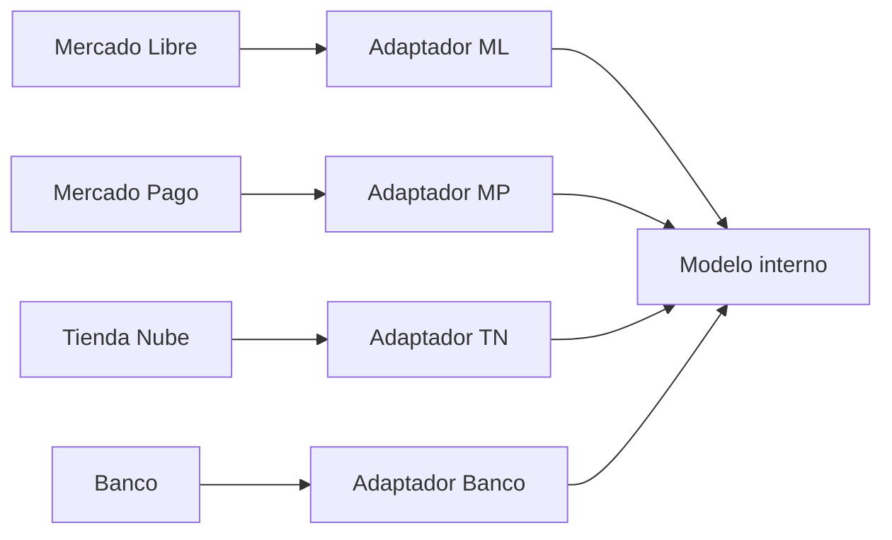
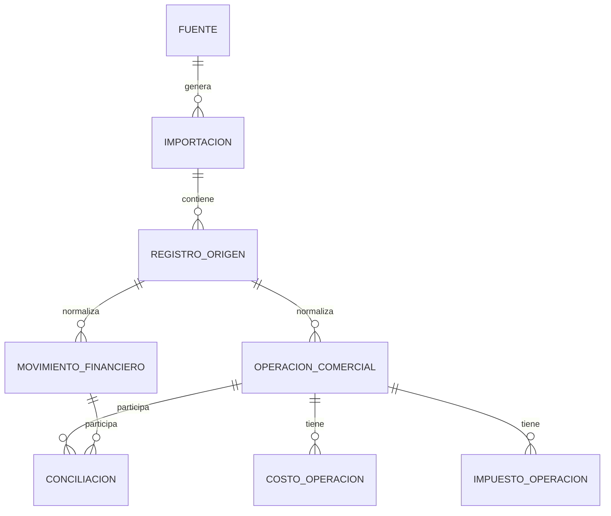
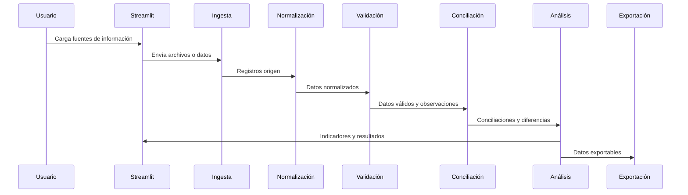

# Documento Maestro del Proyecto

**Proyecto:** Plataforma de Control Financiero, Conciliación y Rentabilidad
**Aplicación inicial:** Conciliación Mercado Libre / Mercado Pago
**Estado:** Documentación fundacional
**Tipo de sistema:** Aplicación profesional en Streamlit orientada a control financiero escalable

---

## 1. Propósito del documento

Este documento constituye la especificación oficial del proyecto. Su objetivo es definir, desde el inicio, la visión funcional, técnica y arquitectónica de una plataforma de control financiero que evolucionará durante años.

La documentación está pensada para que cualquier integrante nuevo del equipo —desarrollador, analista funcional, responsable de producto, tester, consultor financiero o asistente de IA— pueda comprender el alcance del sistema, las decisiones ya tomadas, las restricciones existentes y la forma esperada de evolucionar el producto sin depender de conocimiento informal.

Este documento debe considerarse la fuente principal de verdad del proyecto. Cualquier cambio estructural relevante en la aplicación deberá reflejarse aquí antes o junto con su implementación.

---

## 2. Objetivo general

Desarrollar una aplicación profesional en Streamlit para realizar conciliación financiera, análisis de rentabilidad y control operativo de ventas, cobros, costos, impuestos, comisiones y movimientos financieros provenientes de múltiples fuentes.

La primera versión del sistema se enfocará en conciliar información entre Mercado Libre y Mercado Pago, permitiendo identificar ventas, cobros, comisiones, impuestos, envíos, retenciones, diferencias y estados de conciliación.

La visión de largo plazo es construir una plataforma integral de control financiero que permita centralizar información de canales comerciales, billeteras, bancos, ventas presenciales y sistemas internos, generando indicadores confiables para la toma de decisiones.

---

## 3. Alcance del proyecto

### 3.1 Alcance inicial

El alcance inicial comprende la base conceptual y futura implementación de:

- Carga o ingesta de información exportada desde Mercado Libre.
- Carga o ingesta de información exportada desde Mercado Pago.
- Normalización de datos provenientes de ambas fuentes.
- Conciliación entre operaciones comerciales y movimientos financieros.
- Identificación de diferencias, operaciones pendientes y movimientos no conciliados.
- Cálculo conceptual de importes vinculados a venta, comisiones, retenciones, impuestos y costos.
- Preparación de una base futura para reportes, dashboards, trazabilidad e historial.

### 3.2 Alcance futuro

El sistema deberá poder incorporar progresivamente:

| Área | Descripción |
|---|---|
| Tienda Nube | Conciliación de ventas, pagos y órdenes provenientes de tienda online. |
| Banco | Cruce de acreditaciones, transferencias, gastos y movimientos bancarios. |
| Ventas del local | Registro o importación de ventas presenciales y cobros asociados. |
| Dashboard financiero | Visualización ejecutiva de rentabilidad, flujo y estado del negocio. |
| KPIs | Métricas comerciales, financieras, operativas e impositivas. |
| Reportes | Exportaciones para análisis, gestión administrativa y contabilidad. |
| Base histórica | Persistencia de datos normalizados para comparación temporal. |
| Automatizaciones | Procesos recurrentes de carga, validación, conciliación y alerta. |

### 3.3 Fuera de alcance inicial

No forman parte de la etapa documental ni de las primeras decisiones de implementación:

- Desarrollo de pantallas de Streamlit.
- Implementación de lógica de conciliación.
- Creación de código Python.
- Instalación de dependencias.
- Conexiones reales con APIs externas.
- Persistencia definitiva de datos.
- Automatizaciones productivas.
- Integración con sistemas contables.
- Generación de reportes definitivos.

---

## 4. Filosofía del proyecto

El proyecto no debe tratarse como una herramienta aislada para cruzar dos archivos Excel. Debe concebirse como una plataforma de control financiero modular, auditable y extensible.

Los principios filosóficos son:

1. **Escalabilidad desde el diseño:** cada decisión debe permitir incorporar nuevas fuentes y módulos sin reescrituras profundas.
2. **Trazabilidad:** todo dato transformado o conciliado debe poder rastrearse hasta su origen.
3. **Claridad financiera:** la aplicación debe ayudar a entender el negocio, no solo a procesar archivos.
4. **Separación de responsabilidades:** la interfaz, la lógica de negocio, las transformaciones y la persistencia deben evolucionar de manera desacoplada.
5. **Evolución incremental:** el producto crecerá por versiones, manteniendo estabilidad en los contratos internos.
6. **Documentación viva:** cada nueva regla, fuente, métrica o decisión técnica debe quedar documentada.
7. **Precisión antes que velocidad:** en materia financiera, un resultado rápido pero incorrecto es peor que una advertencia clara o un estado pendiente.

---

## 5. Arquitectura general prevista

La arquitectura deberá organizarse por capas, evitando mezclar presentación, procesamiento, reglas financieras y almacenamiento.



### 5.1 Capas conceptuales

| Capa | Responsabilidad |
|---|---|
| Presentación | Exponer pantallas, formularios, filtros y dashboards en Streamlit. |
| Ingesta | Recibir archivos, APIs o fuentes externas sin aplicar reglas complejas. |
| Normalización | Convertir estructuras heterogéneas a modelos internos consistentes. |
| Validación | Detectar errores de formato, datos faltantes, duplicados e inconsistencias. |
| Conciliación | Relacionar operaciones comerciales con movimientos financieros. |
| Análisis | Calcular rentabilidad, costos, impuestos, comisiones y KPIs. |
| Persistencia | Guardar datos originales, normalizados, conciliados e históricos. |
| Exportación | Generar salidas para usuarios, contabilidad o análisis externo. |

### 5.2 Principio de independencia de fuentes

Cada fuente externa debe integrarse mediante adaptadores o módulos independientes. El modelo interno no debe depender directamente del formato de Mercado Libre, Mercado Pago, Tienda Nube o bancos.



---

## 6. Tecnologías previstas

La selección tecnológica deberá mantenerse simple al inicio, pero preparada para escalar.

| Tecnología | Rol previsto | Observaciones |
|---|---|---|
| Python | Lenguaje principal | Debe usarse para procesamiento, reglas y orquestación. |
| Streamlit | Interfaz web | Adecuado para aplicaciones internas, dashboards y flujos de carga. |
| Pandas | Procesamiento tabular | Útil para importaciones, transformaciones y conciliación inicial. |
| SQLite | Persistencia local inicial posible | Adecuado para prototipos o instalaciones simples. |
| PostgreSQL | Persistencia futura recomendada | Recomendado para historial, multiusuario y mayor volumen. |
| Plotly u otra librería gráfica | Visualizaciones futuras | A definir cuando se implemente dashboard. |
| Pytest | Pruebas automatizadas futuras | Requerido para reglas críticas de conciliación. |

La documentación no implica que estas dependencias deban instalarse en esta etapa. La definición formal de dependencias deberá realizarse cuando comience la implementación.

---

## 7. Roadmap por versiones

### 7.1 Versión 0.0 - Fundación documental

Objetivo: establecer visión, arquitectura, restricciones y documentos oficiales.

Entregables:

- Documento maestro.
- README para desarrolladores.
- Contexto para asistentes de IA.

### 7.2 Versión 0.1 - Prototipo controlado Mercado Libre / Mercado Pago

Objetivo: validar el flujo mínimo de carga, normalización y conciliación con datos exportados manualmente.

Posibles entregables futuros:

- Carga de archivos.
- Validación de columnas obligatorias.
- Normalización básica.
- Conciliación inicial por identificadores.
- Exportación simple de resultados.

### 7.3 Versión 0.2 - Motor de conciliación robusto

Objetivo: formalizar reglas, estados y trazabilidad.

Posibles entregables futuros:

- Estados de conciliación.
- Manejo de diferencias.
- Reglas configurables.
- Reporte de excepciones.
- Pruebas automatizadas de escenarios críticos.

### 7.4 Versión 0.3 - Rentabilidad por operación

Objetivo: calcular rentabilidad considerando costos, comisiones, impuestos y retenciones.

Posibles entregables futuros:

- Cálculo de margen bruto.
- Cálculo de margen neto estimado.
- Configuración de IVA.
- Incorporación de costos de envío y financiación.
- Vista de rentabilidad por venta, producto o período.

### 7.5 Versión 0.4 - Persistencia histórica

Objetivo: pasar de análisis puntual a base histórica consultable.

Posibles entregables futuros:

- Base de datos local o remota.
- Control de importaciones.
- Evitar duplicación de operaciones.
- Auditoría de cargas.
- Consultas por período.

### 7.6 Versión 0.5 - Dashboard financiero

Objetivo: ofrecer indicadores ejecutivos y operativos.

Posibles entregables futuros:

- KPIs comerciales.
- KPIs financieros.
- Evolución de ventas.
- Evolución de márgenes.
- Alertas de diferencias.
- Tableros por canal.

### 7.7 Versión 1.0 - Plataforma operativa estable

Objetivo: disponer de una herramienta confiable para uso recurrente.

Criterios esperados:

- Conciliación estable.
- Persistencia histórica.
- Reportes exportables.
- Dashboard funcional.
- Documentación actualizada.
- Pruebas sobre reglas críticas.
- Proceso claro de despliegue y operación.

---

## 8. Modelo de datos conceptual

El modelo conceptual debe representar operaciones comerciales, movimientos financieros, conciliaciones, costos e impuestos de forma independiente de la fuente original.



### 8.1 Entidades conceptuales

| Entidad | Descripción |
|---|---|
| Fuente | Sistema externo o interno que provee datos. |
| Importación | Evento de carga de información desde una fuente. |
| Registro origen | Fila, evento o documento recibido sin transformación destructiva. |
| Operación comercial | Venta, devolución, cancelación u otra operación de negocio. |
| Movimiento financiero | Cobro, acreditación, comisión, retención, transferencia o ajuste. |
| Conciliación | Relación entre operaciones y movimientos según reglas definidas. |
| Costo operación | Costo asociado a venta, envío, financiación, comisión u otro concepto. |
| Impuesto operación | IVA, retención, percepción u otro componente impositivo. |
| Configuración | Parámetros de negocio, tasas, criterios y reglas vigentes. |

### 8.2 Identificadores esperados

El sistema deberá preservar identificadores externos siempre que existan:

- ID de venta.
- ID de orden.
- ID de pago.
- ID de movimiento.
- ID de envío.
- ID de operación bancaria.
- Fecha de operación.
- Fecha de acreditación.
- Canal de venta.
- Fuente de origen.

---

## 9. Fuentes de información

### 9.1 Mercado Libre

Fuente comercial principal en la etapa inicial. Puede aportar:

- Ventas.
- Órdenes.
- Productos.
- Cantidades.
- Precios de venta.
- Bonificaciones.
- Costos de envío.
- Estado de operación.
- Datos de comprador.
- Fechas comerciales.

### 9.2 Mercado Pago

Fuente financiera principal en la etapa inicial. Puede aportar:

- Cobros.
- Acreditaciones.
- Comisiones.
- Retenciones.
- Impuestos.
- Contracargos.
- Devoluciones.
- Transferencias.
- Movimientos de cuenta.
- Fechas financieras.

### 9.3 Tienda Nube

Fuente futura para ventas de ecommerce propio. Deberá integrarse sin alterar el modelo conceptual general.

### 9.4 Banco

Fuente futura para conciliación de acreditaciones, transferencias, gastos, comisiones bancarias y movimientos contables.

### 9.5 Ventas del local

Fuente futura para ventas presenciales. Podrá integrarse por carga manual, planillas, sistema de punto de venta o API.

---

## 10. Flujo general del sistema



### 10.1 Etapas del flujo

1. **Recepción:** el usuario carga o sincroniza información.
2. **Registro:** se conserva referencia del origen y evento de importación.
3. **Normalización:** se traducen columnas y formatos a estructuras internas.
4. **Validación:** se detectan datos incompletos, duplicados o inconsistentes.
5. **Conciliación:** se vinculan operaciones comerciales con movimientos financieros.
6. **Clasificación:** se asignan estados y motivos.
7. **Análisis:** se calculan diferencias, rentabilidad y métricas.
8. **Presentación:** se muestran resultados, filtros y alertas.
9. **Exportación:** se generan archivos o reportes para uso externo.
10. **Persistencia:** se guarda historial cuando exista base definitiva.

---

## 11. Modelo de conciliación

La conciliación debe ser entendida como un proceso de correspondencia entre eventos de negocio y eventos financieros. No siempre existirá una relación uno a uno.

### 11.1 Tipos de relación posibles

| Tipo | Ejemplo |
|---|---|
| Uno a uno | Una venta se corresponde con un cobro específico. |
| Uno a muchos | Una venta genera cobro, comisión, retención y ajuste. |
| Muchos a uno | Varias ventas se acreditan en una transferencia consolidada. |
| Muchos a muchos | Liquidaciones agrupadas con múltiples ventas y múltiples cargos. |
| Sin contraparte | Movimiento financiero no identificado o venta pendiente de cobro. |

### 11.2 Criterios de conciliación previstos

Los criterios deberán poder combinarse según la fuente:

- Identificadores externos exactos.
- Fechas de operación y acreditación.
- Importes brutos y netos.
- Moneda.
- Canal.
- Estado de la venta o pago.
- Referencias textuales.
- Tolerancias por redondeo.
- Reglas de agrupación.
- Reglas específicas por proveedor.

### 11.3 Resultado de conciliación

Cada conciliación deberá registrar:

- Operaciones involucradas.
- Movimientos involucrados.
- Regla aplicada.
- Estado resultante.
- Diferencia calculada.
- Fecha de procesamiento.
- Observaciones.
- Nivel de confianza, si corresponde.

---

## 12. Estados posibles de una conciliación

| Estado | Descripción | Acción esperada |
|---|---|---|
| Conciliada | La operación y los movimientos coinciden según reglas definidas. | Puede considerarse cerrada. |
| Conciliada con diferencia menor | Existe una diferencia dentro de tolerancia definida. | Revisar si la tolerancia es aceptable. |
| Conciliada con diferencia | Existe contraparte, pero los importes no coinciden. | Requiere análisis. |
| Pendiente de cobro | Venta u operación comercial sin movimiento financiero asociado. | Esperar acreditación o investigar. |
| Movimiento no identificado | Movimiento financiero sin operación comercial asociada. | Clasificar manualmente o ajustar reglas. |
| Duplicada | Se detectan registros potencialmente repetidos. | Bloquear cierre hasta resolver. |
| Cancelada | Operación anulada o revertida. | Verificar impacto financiero. |
| Devuelta | Operación con devolución total o parcial. | Conciliar venta y devolución. |
| En revisión | No hay evidencia suficiente para decisión automática. | Revisión manual. |
| Excluida | Registro fuera del alcance de conciliación. | Mantener trazabilidad del motivo. |

---

## 13. Configuración del IVA

El sistema deberá contemplar que el tratamiento impositivo puede cambiar por empresa, categoría, período, jurisdicción o tipo de comprobante.

### 13.1 Principios

- Las tasas de IVA no deben quedar codificadas de forma rígida en reglas dispersas.
- La configuración debe poder modificarse sin alterar el motor central.
- Todo cálculo impositivo debe indicar base, tasa, importe y criterio utilizado.
- Debe diferenciarse entre valores brutos, netos, impuestos, retenciones y percepciones.

### 13.2 Configuración conceptual

| Parámetro | Descripción |
|---|---|
| Tasa de IVA general | Porcentaje aplicado a operaciones alcanzadas. |
| Tasa diferencial | Porcentaje alternativo para productos o casos especiales. |
| Condición fiscal | Situación fiscal de la empresa o contraparte. |
| Vigencia desde/hasta | Período de validez de la configuración. |
| Criterio de cálculo | Inclusión o exclusión de IVA en precios de venta. |
| Redondeo | Política de redondeo aplicable. |

### 13.3 Consideración importante

La aplicación debe asistir en el análisis financiero, pero no reemplaza asesoramiento contable o fiscal profesional. Cualquier cálculo de IVA, retención o percepción deberá ser validado por responsables contables antes de utilizarse para declaraciones formales.

---

## 14. Dashboard futuro

El dashboard deberá evolucionar desde una vista operativa hacia un tablero ejecutivo.

### 14.1 Indicadores previstos

| Categoría | Indicadores posibles |
|---|---|
| Ventas | Ventas brutas, ventas netas, unidades, ticket promedio. |
| Rentabilidad | Margen bruto, margen neto, rentabilidad por canal, rentabilidad por producto. |
| Conciliación | Operaciones conciliadas, pendientes, diferencias, duplicados. |
| Finanzas | Acreditaciones, saldos, transferencias, flujo de fondos. |
| Costos | Comisiones, envíos, financiación, impuestos, descuentos. |
| Alertas | Diferencias relevantes, movimientos no identificados, caídas de margen. |

### 14.2 Principios de visualización

- Mostrar primero información accionable.
- Permitir filtros por período, canal, estado y fuente.
- Diferenciar métricas confirmadas de métricas estimadas.
- Evitar indicadores ambiguos sin definición documentada.
- Permitir exportar la información utilizada en cada gráfico.

---

## 15. Exportaciones

Las exportaciones deberán diseñarse como productos de información controlados, no como simples volcados de datos.

### 15.1 Exportaciones previstas

- Resultado de conciliación.
- Operaciones pendientes.
- Movimientos no identificados.
- Diferencias por período.
- Rentabilidad por operación.
- Rentabilidad por producto.
- Resumen para contabilidad.
- Reporte ejecutivo mensual.

### 15.2 Requisitos de exportación

Toda exportación debería incluir:

- Fecha de generación.
- Período analizado.
- Fuente de datos.
- Versión o criterio de reglas aplicado.
- Filtros utilizados.
- Totales de control.
- Advertencias si existen datos incompletos.

---

## 16. Reglas de desarrollo

### 16.1 Reglas generales

- No mezclar lógica de negocio con código de interfaz.
- No depender directamente de nombres de columnas externas en el dominio central.
- No destruir datos originales durante normalizaciones.
- No ocultar diferencias financieras.
- No asumir que todos los movimientos están en la misma moneda o fecha contable.
- No implementar reglas financieras sin documentación.
- No introducir cambios estructurales sin actualizar este documento.

### 16.2 Reglas para futuras implementaciones

- Cada módulo debe tener responsabilidad clara.
- Las funciones críticas deben ser testeables sin Streamlit.
- Las reglas de conciliación deben ser explícitas y auditables.
- Los errores de datos deben informarse de forma comprensible.
- Las tolerancias deben ser configurables y justificadas.
- Las fuentes externas deben integrarse mediante adaptadores.

---

## 17. Principios de arquitectura

| Principio | Aplicación práctica |
|---|---|
| Modularidad | Separar fuentes, dominio, conciliación, reportes e interfaz. |
| Bajo acoplamiento | Evitar dependencias cruzadas innecesarias entre módulos. |
| Alta cohesión | Cada componente debe resolver un problema específico. |
| Trazabilidad | Mantener referencia entre dato original, normalizado y resultado. |
| Idempotencia | Reprocesar una importación no debe duplicar resultados. |
| Auditabilidad | Cada cálculo relevante debe poder explicarse. |
| Extensibilidad | Agregar una fuente no debe romper fuentes existentes. |
| Testabilidad | Las reglas financieras deben poder probarse automáticamente. |

---

## 18. Buenas prácticas esperadas

- Mantener nombres claros y consistentes.
- Documentar decisiones técnicas relevantes.
- Usar modelos internos estables.
- Diseñar validaciones antes de cálculos financieros.
- Preferir claridad sobre optimizaciones prematuras.
- Mantener separación entre datos crudos y datos procesados.
- Registrar advertencias y errores de conciliación.
- Evitar supuestos silenciosos.
- Revisar impacto fiscal o contable con especialistas.
- Mantener documentación actualizada en cada versión.

---

## 19. Estructura de carpetas prevista

La siguiente estructura es conceptual y no debe crearse hasta que comience la implementación.

```text
control_operativo_app/
├── app/                         # Aplicación Streamlit futura
│   ├── pages/                   # Páginas o secciones de interfaz
│   └── components/              # Componentes reutilizables de UI
├── src/                         # Código principal de negocio
│   ├── ingestion/               # Ingesta de fuentes
│   ├── adapters/                # Adaptadores por proveedor
│   ├── normalization/           # Normalización de datos
│   ├── validation/              # Validaciones de estructura y negocio
│   ├── reconciliation/          # Motor de conciliación
│   ├── analytics/               # Rentabilidad, KPIs y métricas
│   ├── exports/                 # Generación de reportes
│   └── persistence/             # Acceso a base de datos
├── tests/                       # Pruebas automatizadas futuras
├── docs/                        # Documentación complementaria futura
├── DOCUMENTO_MAESTRO.md         # Especificación oficial
├── README.md                    # Guía resumida para desarrolladores
└── AI_CONTEXT.md                # Contexto operativo para asistentes de IA
```

---

## 20. Riesgos conocidos

| Riesgo | Impacto | Mitigación prevista |
|---|---|---|
| Cambios en formatos de exportación | Errores de ingesta o conciliación | Adaptadores por fuente y validación de columnas. |
| Datos incompletos | Conciliaciones incorrectas | Estados pendientes y reportes de calidad de datos. |
| Duplicación de importaciones | Totales incorrectos | Identificadores de importación e idempotencia. |
| Reglas fiscales variables | Cálculos imprecisos | Configuración versionada y validación contable. |
| Acoplamiento temprano | Dificultad para escalar | Arquitectura por capas desde el inicio. |
| Falta de trazabilidad | Pérdida de confianza en resultados | Conservación de datos origen y reglas aplicadas. |
| Volumen creciente | Lentitud o límites de memoria | Persistencia y procesamiento incremental futuro. |
| Interpretación incorrecta de comisiones | Rentabilidad errónea | Documentar fórmulas y validar con casos reales. |

---

## 21. Supuestos

- El sistema será utilizado inicialmente como herramienta interna de gestión financiera.
- Las primeras integraciones podrán basarse en archivos exportados manualmente.
- La aplicación inicial será desarrollada en Streamlit.
- Python será el lenguaje principal.
- El modelo deberá soportar más fuentes que Mercado Libre y Mercado Pago.
- La conciliación requerirá revisión manual en casos ambiguos.
- La precisión financiera es prioritaria frente a automatización total.
- La documentación deberá actualizarse durante toda la vida del proyecto.

---

## 22. Decisiones técnicas tomadas

| Decisión | Justificación |
|---|---|
| Usar Streamlit como interfaz inicial | Permite construir herramientas internas y dashboards con rapidez. |
| Diseñar arquitectura por capas | Evita mezclar interfaz, reglas y datos. |
| Comenzar con Mercado Libre y Mercado Pago | Son las fuentes iniciales de mayor prioridad. |
| Mantener independencia del modelo interno | Facilita incorporar Tienda Nube, bancos y ventas locales. |
| Documentar antes de implementar | Reduce ambigüedad y orienta el crecimiento profesional del sistema. |
| No crear código en la fase fundacional | Evita decisiones prematuras antes de definir arquitectura y alcance. |

---

## 23. Qué todavía NO debe implementarse

Hasta que se defina una etapa específica de implementación, no debe crearse:

- Código Python de aplicación.
- Archivo `app.py`.
- Archivos de dependencias.
- Pantallas de Streamlit.
- Lógica de conciliación.
- Modelos de base de datos físicos.
- Carpetas de estructura futura.
- Tests automatizados.
- Conectores con APIs.
- Automatizaciones.
- Dashboards reales.

La única base actual del proyecto debe ser documental.

---

## 24. Visión a largo plazo

La visión del proyecto es convertirse en una plataforma integral de control financiero para negocios que operan en múltiples canales de venta y cobranza.

En su estado maduro, la plataforma debería permitir:

- Centralizar datos comerciales y financieros.
- Conciliar ventas, cobros, comisiones, impuestos y acreditaciones.
- Medir rentabilidad por canal, producto, período y operación.
- Detectar diferencias y riesgos operativos.
- Generar reportes para gestión y contabilidad.
- Construir una base histórica confiable.
- Automatizar procesos repetitivos.
- Servir como tablero financiero para la toma de decisiones.

El sistema debe crecer de forma ordenada, manteniendo como ejes la trazabilidad, la auditabilidad, la claridad financiera y la extensibilidad técnica.

---

## 25. Gobierno de la documentación

Este documento debe actualizarse cuando ocurra cualquiera de los siguientes eventos:

- Se incorpora una nueva fuente de datos.
- Se modifica el modelo de conciliación.
- Se agregan estados de conciliación.
- Se define una nueva regla fiscal o financiera.
- Se cambia la arquitectura técnica.
- Se incorpora persistencia histórica.
- Se agregan KPIs oficiales.
- Se formaliza una nueva versión del roadmap.

Toda implementación futura debe poder vincularse con una sección de este documento o proponer su actualización.
