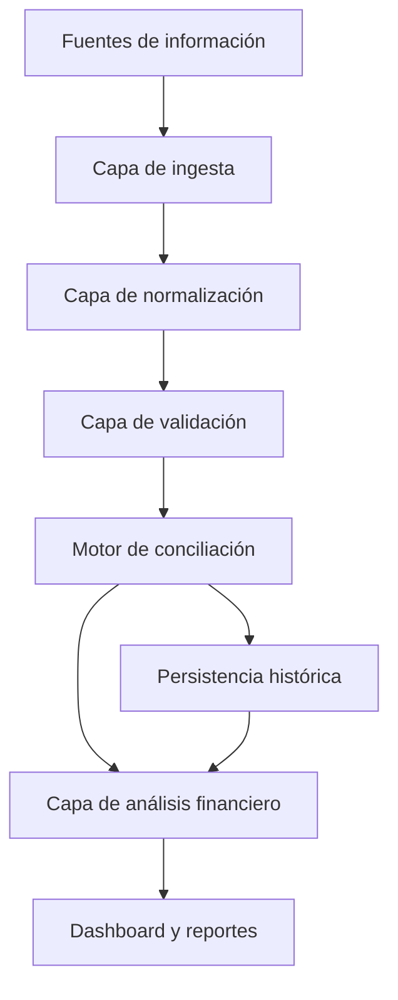
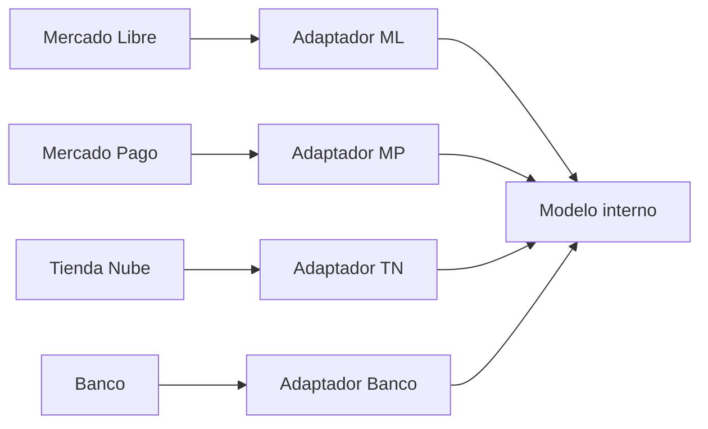
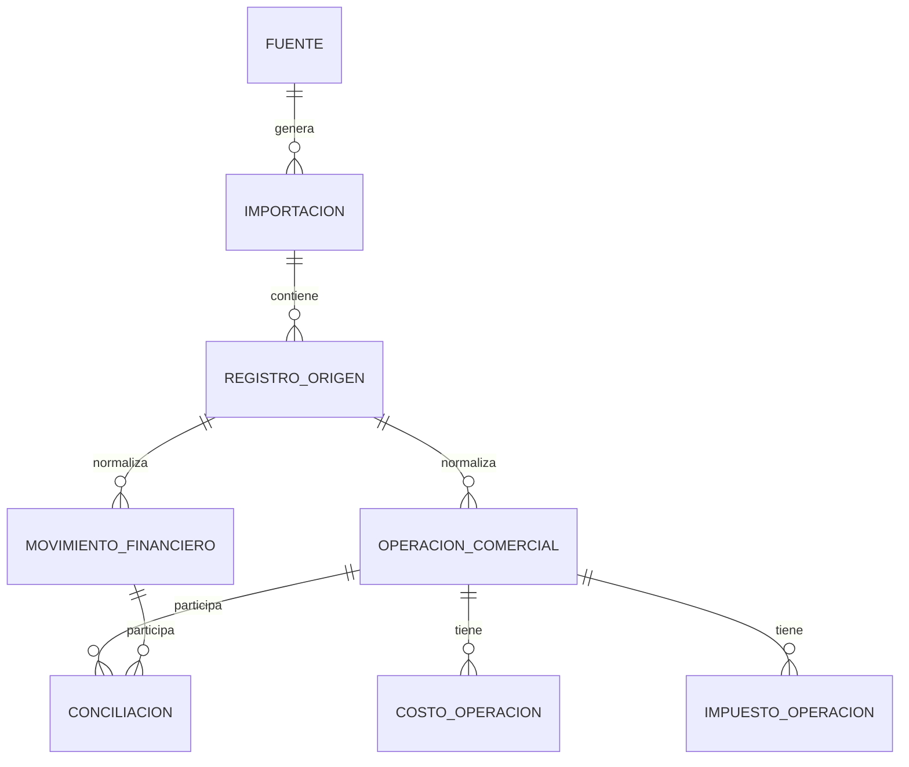
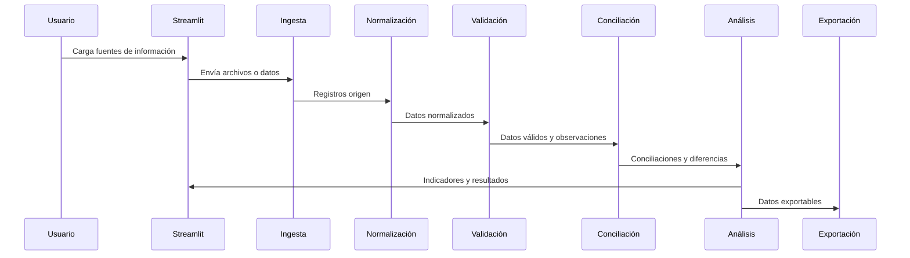

# Documento Maestro del Proyecto

**Proyecto:** Kiki Control Financiero
**Aplicación inicial:** Conciliación Mercado Libre / Mercado Pago
**Estado:** Versión 0.1 aprobada para implementación
**Tipo de sistema:** Aplicación profesional en Streamlit orientada a control financiero escalable

---

## 1. Propósito del documento

Este documento constituye la especificación oficial del proyecto y la fuente principal de verdad para Kiki Control Financiero. Su objetivo es definir, desde el inicio, la visión funcional, técnica y arquitectónica de una plataforma de control financiero que evolucionará durante años.

La documentación está pensada para que cualquier integrante nuevo del equipo —desarrollador, analista funcional, responsable de producto, tester, consultor financiero o asistente de IA— pueda comprender el alcance del sistema, las decisiones ya tomadas, las restricciones existentes y la forma esperada de evolucionar el producto sin depender de conocimiento informal.

Este documento debe considerarse la fuente principal de verdad del proyecto. Cualquier cambio estructural relevante en la aplicación deberá reflejarse aquí antes o junto con su implementación.

---

## 2. Objetivo general

Desarrollar una aplicación profesional en Streamlit para realizar conciliación financiera, análisis de rentabilidad y control operativo de ventas, cobros, costos, impuestos, comisiones y movimientos financieros provenientes de múltiples fuentes.

La primera versión del sistema se enfocará en conciliar información entre Mercado Libre y Mercado Pago, permitiendo identificar ventas, cobros, comisiones, impuestos, envíos, retenciones, diferencias y estados de conciliación.

La visión de largo plazo es construir una plataforma integral de control financiero que permita centralizar información de canales comerciales, billeteras, bancos, ventas presenciales y sistemas internos, generando indicadores confiables para la toma de decisiones.

---

## 3. Alcance del proyecto

### 3.1 Alcance inicial aprobado para versión 0.1

La versión 0.1 queda aprobada para implementación incremental después de esta actualización documental. El requerimiento real del cliente es construir una aplicación de control cruzado que relacione fuentes comerciales con fuentes financieras para conocer el resultado de cada operación a partir del cruce entre la venta comercial y sus movimientos financieros reales.

El alcance inicial comprende archivos exportados manualmente de Mercado Libre y Mercado Pago, sin APIs ni cargas automáticas:

- Carga del archivo comercial de Mercado Libre con ventas, productos, cantidades, costos y métricas de rentabilidad informadas por la fuente.
- Carga del archivo financiero de Mercado Pago con pagos, acreditaciones, comisiones, financiación, envíos, impuestos, retenciones, devoluciones, reclamos y otros movimientos.
- Conservación íntegra y auditable de ambos archivos originales, sin modificaciones destructivas.
- Validación de estructura, columnas y formatos.
- Normalización mediante adaptadores independientes para cada fuente.
- Relación de operaciones principalmente mediante ID Order.
- Agrupación de múltiples movimientos financieros pertenecientes a una misma orden.
- Comparación entre el neto informado por la fuente comercial y el neto real registrado en Mercado Pago.
- Identificación de coincidencias, diferencias, devoluciones, reclamos, pagos divididos y movimientos sin contraparte.
- Visualización del resultado por operación y totales de control.
- Preparación para exportaciones posteriores de resultados, sin definir todavía su estructura final.


### 3.2 Resultado de la operación en versión 0.1

La aplicación deberá diferenciar claramente estos conceptos, sin mezclarlos ni asumir que son equivalentes:

| Concepto | Tratamiento inicial |
|---|---|
| Utilidad o rentabilidad informada por Mercado Libre | Debe conservarse como valor informado por la fuente comercial. |
| Monto neto financiero real de Mercado Pago | Será el principal total de control inicial para conciliación. |
| Diferencia de conciliación | Se calculará entre el neto comercial informado y el neto financiero agrupado. |
| Estado de conciliación | Se asignará según reglas explícitas y auditables. |
| Resultado operativo definitivo | Su fórmula queda pendiente de validación contable antes de considerarse oficial. |

No deben inventarse fórmulas fiscales. Los costos, IVA, IIBB, retenciones y percepciones deberán documentarse y ser configurables. Hasta contar con validación contable, las métricas calculadas por Mercado Libre se consideran valores informados por la fuente, no verdad fiscal definitiva.

### 3.3 Alcance futuro

El sistema deberá poder incorporar progresivamente:

| Área | Descripción |
|---|---|
| Tienda Nube | Conciliación de ventas, pagos y órdenes provenientes de tienda online. |
| Banco | Cruce de acreditaciones, transferencias, gastos y movimientos bancarios. |
| Ventas del local | Registro o importación de ventas presenciales y cobros asociados. |
| Dashboard financiero | Visualización ejecutiva de rentabilidad, flujo y estado del negocio. |
| KPIs | Métricas comerciales, financieras, operativas e impositivas. |
| Reportes | Exportaciones para análisis, gestión administrativa y contabilidad. |
| Base histórica | Persistencia de datos normalizados para comparación temporal. |
| Automatizaciones | Procesos recurrentes de carga, validación, conciliación y alerta. |

### 3.4 Fuera de alcance inicial

No forman parte de la etapa documental ni de las primeras decisiones de implementación:

- Desarrollo de pantallas de Streamlit.
- Implementación de lógica de conciliación.
- Creación de código Python.
- Instalación de dependencias.
- Conexiones reales con APIs externas.
- Persistencia definitiva de datos.
- Automatizaciones productivas.
- Integración con sistemas contables.
- Generación de reportes definitivos.

---

## 4. Filosofía del proyecto

El proyecto no debe tratarse como una herramienta aislada para cruzar dos archivos Excel. Debe concebirse como una plataforma de control financiero modular, auditable y extensible.

Los principios filosóficos son:

1. **Escalabilidad desde el diseño:** cada decisión debe permitir incorporar nuevas fuentes y módulos sin reescrituras profundas.
2. **Trazabilidad:** todo dato transformado o conciliado debe poder rastrearse hasta su origen.
3. **Claridad financiera:** la aplicación debe ayudar a entender el negocio, no solo a procesar archivos.
4. **Separación de responsabilidades:** la interfaz, la lógica de negocio, las transformaciones y la persistencia deben evolucionar de manera desacoplada.
5. **Evolución incremental:** el producto crecerá por versiones, manteniendo estabilidad en los contratos internos.
6. **Documentación viva:** cada nueva regla, fuente, métrica o decisión técnica debe quedar documentada.
7. **Precisión antes que velocidad:** en materia financiera, un resultado rápido pero incorrecto es peor que una advertencia clara o un estado pendiente.

---

## 5. Arquitectura general prevista

La arquitectura deberá organizarse por capas, evitando mezclar presentación, procesamiento, reglas financieras y almacenamiento.



### 5.1 Capas conceptuales

| Capa | Responsabilidad |
|---|---|
| Presentación | Exponer pantallas, formularios, filtros y dashboards en Streamlit. |
| Ingesta | Recibir archivos, APIs o fuentes externas sin aplicar reglas complejas. |
| Normalización | Convertir estructuras heterogéneas a modelos internos consistentes. |
| Validación | Detectar errores de formato, datos faltantes, duplicados e inconsistencias. |
| Conciliación | Relacionar operaciones comerciales con movimientos financieros. |
| Análisis | Calcular rentabilidad, costos, impuestos, comisiones y KPIs. |
| Persistencia | Guardar datos originales, normalizados, conciliados e históricos. |
| Exportación | Generar salidas para usuarios, contabilidad o análisis externo. |

### 5.2 Principio de independencia de fuentes

Cada fuente externa debe integrarse mediante adaptadores o módulos independientes. El modelo interno no debe depender directamente del formato de Mercado Libre, Mercado Pago, Tienda Nube o bancos.



---

## 6. Tecnologías previstas

La selección tecnológica deberá mantenerse simple al inicio, pero preparada para escalar.

| Tecnología | Rol previsto | Observaciones |
|---|---|---|
| Python | Lenguaje principal | Debe usarse para procesamiento, reglas y orquestación. |
| Streamlit | Interfaz web | Adecuado para aplicaciones internas, dashboards y flujos de carga. |
| Pandas | Procesamiento tabular | Útil para importaciones, transformaciones y conciliación inicial. |
| SQLite | Persistencia local inicial posible | Adecuado para prototipos o instalaciones simples. |
| PostgreSQL | Persistencia futura recomendada | Recomendado para historial, multiusuario y mayor volumen. |
| Plotly u otra librería gráfica | Visualizaciones futuras | A definir cuando se implemente dashboard. |
| Pytest | Pruebas automatizadas futuras | Requerido para reglas críticas de conciliación. |

La documentación no implica que estas dependencias deban instalarse en esta etapa. La definición formal de dependencias deberá realizarse cuando comience la implementación.

---

## 7. Roadmap por versiones

### 7.1 Versión 0.0 - Fundación documental

Objetivo: establecer visión, arquitectura, restricciones y documentos oficiales.

Entregables:

- Documento maestro.
- README para desarrolladores.
- Contexto para asistentes de IA.

### 7.2 Versión 0.1 - Control cruzado Mercado Libre / Mercado Pago

Objetivo: implementar de manera incremental el flujo mínimo de carga, validación, normalización y conciliación con archivos exportados manualmente de Mercado Libre y Mercado Pago. Esta versión queda aprobada para implementación después de la actualización documental del inicio formal del desarrollo.

Entregables previstos:

- Carga de archivos.
- Validación de columnas obligatorias.
- Normalización básica.
- Conciliación inicial por identificadores.
- Exportación simple de resultados en una etapa posterior, una vez definida la estructura exacta.

### 7.3 Versión 0.2 - Motor de conciliación robusto

Objetivo: formalizar reglas, estados y trazabilidad.

Posibles entregables futuros:

- Estados de conciliación.
- Manejo de diferencias.
- Reglas configurables.
- Reporte de excepciones.
- Pruebas automatizadas de escenarios críticos.

### 7.4 Versión 0.3 - Rentabilidad por operación

Objetivo: calcular rentabilidad considerando costos, comisiones, impuestos y retenciones.

Posibles entregables futuros:

- Cálculo de margen bruto.
- Cálculo de margen neto estimado.
- Configuración de IVA.
- Incorporación de costos de envío y financiación.
- Vista de rentabilidad por venta, producto o período.

### 7.5 Versión 0.4 - Persistencia histórica

Objetivo: pasar de análisis puntual a base histórica consultable.

Posibles entregables futuros:

- Base de datos local o remota.
- Control de importaciones.
- Evitar duplicación de operaciones.
- Auditoría de cargas.
- Consultas por período.

### 7.6 Versión 0.5 - Dashboard financiero

Objetivo: ofrecer indicadores ejecutivos y operativos.

Posibles entregables futuros:

- KPIs comerciales.
- KPIs financieros.
- Evolución de ventas.
- Evolución de márgenes.
- Alertas de diferencias.
- Tableros por canal.

### 7.7 Versión 1.0 - Plataforma operativa estable

Objetivo: disponer de una herramienta confiable para uso recurrente.

Criterios esperados:

- Conciliación estable.
- Persistencia histórica.
- Reportes exportables.
- Dashboard funcional.
- Documentación actualizada.
- Pruebas sobre reglas críticas.
- Proceso claro de despliegue y operación.

---

## 8. Modelo de datos conceptual

El modelo conceptual debe representar operaciones comerciales, movimientos financieros, conciliaciones, costos e impuestos de forma independiente de la fuente original.



### 8.1 Entidades conceptuales

| Entidad | Descripción |
|---|---|
| Fuente | Sistema externo o interno que provee datos. |
| Importación | Evento de carga de información desde una fuente. |
| Registro origen | Fila, evento o documento recibido sin transformación destructiva. |
| Operación comercial | Venta, devolución, cancelación u otra operación de negocio. |
| Movimiento financiero | Cobro, acreditación, comisión, retención, transferencia o ajuste. |
| Conciliación | Relación entre operaciones y movimientos según reglas definidas. |
| Costo operación | Costo asociado a venta, envío, financiación, comisión u otro concepto. |
| Impuesto operación | IVA, retención, percepción u otro componente impositivo. |
| Configuración | Parámetros de negocio, tasas, criterios y reglas vigentes. |

### 8.2 Identificadores esperados

El sistema deberá preservar identificadores externos siempre que existan:

- ID de venta.
- ID de orden.
- ID de pago.
- ID de movimiento.
- ID de envío.
- ID de operación bancaria.
- Fecha de operación.
- Fecha de acreditación.
- Canal de venta.
- Fuente de origen.

---

## 9. Fuentes de información

### 9.1 Mercado Libre

Fuente comercial principal en la etapa inicial. Puede aportar:

- Ventas.
- Órdenes.
- Productos.
- Cantidades.
- Precios de venta.
- Bonificaciones.
- Costos de envío.
- Estado de operación.
- Datos de comprador.
- Fechas comerciales.

### 9.2 Mercado Pago

Fuente financiera principal en la etapa inicial. Puede aportar:

- Cobros.
- Acreditaciones.
- Comisiones.
- Retenciones.
- Impuestos.
- Contracargos.
- Devoluciones.
- Transferencias.
- Movimientos de cuenta.
- Fechas financieras.

### 9.3 Tienda Nube

Fuente futura para ventas de ecommerce propio. Deberá integrarse sin alterar el modelo conceptual general.

### 9.4 Banco

Fuente futura para conciliación de acreditaciones, transferencias, gastos, comisiones bancarias y movimientos contables.

### 9.5 Ventas del local

Fuente futura para ventas presenciales. Podrá integrarse por carga manual, planillas, sistema de punto de venta o API.

---

## 10. Flujo general del sistema



### 10.1 Etapas del flujo

1. **Recepción:** el usuario carga o sincroniza información.
2. **Registro:** se conserva referencia del origen y evento de importación.
3. **Normalización:** se traducen columnas y formatos a estructuras internas.
4. **Validación:** se detectan datos incompletos, duplicados o inconsistentes.
5. **Conciliación:** se vinculan operaciones comerciales con movimientos financieros.
6. **Clasificación:** se asignan estados y motivos.
7. **Análisis:** se calculan diferencias, rentabilidad y métricas.
8. **Presentación:** se muestran resultados, filtros y alertas.
9. **Exportación:** se generan archivos o reportes para uso externo.
10. **Persistencia:** se guarda historial cuando exista base definitiva.

---

## 11. Modelo de conciliación

La conciliación debe ser entendida como un proceso de correspondencia entre eventos de negocio y eventos financieros. No siempre existirá una relación uno a uno.

### 11.1 Tipos de relación posibles

| Tipo | Ejemplo |
|---|---|
| Uno a uno | Una venta se corresponde con un cobro específico. |
| Uno a muchos | Una venta genera cobro, comisión, retención y ajuste. |
| Muchos a uno | Varias ventas se acreditan en una transferencia consolidada. |
| Muchos a muchos | Liquidaciones agrupadas con múltiples ventas y múltiples cargos. |
| Sin contraparte | Movimiento financiero no identificado o venta pendiente de cobro. |

### 11.2 Criterios de conciliación previstos

Los criterios deberán poder combinarse según la fuente:

- Identificadores externos exactos.
- Fechas de operación y acreditación.
- Importes brutos y netos.
- Moneda.
- Canal.
- Estado de la venta o pago.
- Referencias textuales.
- Tolerancias por redondeo.
- Reglas de agrupación.
- Reglas específicas por proveedor.

### 11.3 Resultado de conciliación

Cada conciliación deberá registrar:

- Operaciones involucradas.
- Movimientos involucrados.
- Regla aplicada.
- Estado resultante.
- Diferencia calculada.
- Fecha de procesamiento.
- Observaciones.
- Nivel de confianza, si corresponde.

---

## 12. Estados posibles de una conciliación

| Estado | Descripción | Acción esperada |
|---|---|---|
| Conciliada | La operación y los movimientos coinciden según reglas definidas. | Puede considerarse cerrada. |
| Conciliada con diferencia menor | Existe una diferencia dentro de tolerancia definida. | Revisar si la tolerancia es aceptable. |
| Conciliada con diferencia | Existe contraparte, pero los importes no coinciden. | Requiere análisis. |
| Pendiente de cobro | Venta u operación comercial sin movimiento financiero asociado. | Esperar acreditación o investigar. |
| Movimiento no identificado | Movimiento financiero sin operación comercial asociada. | Clasificar manualmente o ajustar reglas. |
| Duplicada | Se detectan registros potencialmente repetidos. | Bloquear cierre hasta resolver. |
| Cancelada | Operación anulada o revertida. | Verificar impacto financiero. |
| Devuelta | Operación con devolución total o parcial. | Conciliar venta y devolución. |
| En revisión | No hay evidencia suficiente para decisión automática. | Revisión manual. |
| Excluida | Registro fuera del alcance de conciliación. | Mantener trazabilidad del motivo. |

---

## 13. Configuración del IVA

El sistema deberá contemplar que el tratamiento impositivo puede cambiar por empresa, categoría, período, jurisdicción o tipo de comprobante.

### 13.1 Principios

- Las tasas de IVA no deben quedar codificadas de forma rígida en reglas dispersas.
- La configuración debe poder modificarse sin alterar el motor central.
- Todo cálculo impositivo debe indicar base, tasa, importe y criterio utilizado.
- Debe diferenciarse entre valores brutos, netos, impuestos, retenciones y percepciones.

### 13.2 Configuración conceptual

| Parámetro | Descripción |
|---|---|
| Tasa de IVA general | Porcentaje aplicado a operaciones alcanzadas. |
| Tasa diferencial | Porcentaje alternativo para productos o casos especiales. |
| Condición fiscal | Situación fiscal de la empresa o contraparte. |
| Vigencia desde/hasta | Período de validez de la configuración. |
| Criterio de cálculo | Inclusión o exclusión de IVA en precios de venta. |
| Redondeo | Política de redondeo aplicable. |

### 13.3 Consideración importante

La aplicación debe asistir en el análisis financiero, pero no reemplaza asesoramiento contable o fiscal profesional. Cualquier cálculo de IVA, retención o percepción deberá ser validado por responsables contables antes de utilizarse para declaraciones formales.

---

## 14. Dashboard futuro

El dashboard deberá evolucionar desde una vista operativa hacia un tablero ejecutivo.

### 14.1 Indicadores previstos

| Categoría | Indicadores posibles |
|---|---|
| Ventas | Ventas brutas, ventas netas, unidades, ticket promedio. |
| Rentabilidad | Margen bruto, margen neto, rentabilidad por canal, rentabilidad por producto. |
| Conciliación | Operaciones conciliadas, pendientes, diferencias, duplicados. |
| Finanzas | Acreditaciones, saldos, transferencias, flujo de fondos. |
| Costos | Comisiones, envíos, financiación, impuestos, descuentos. |
| Alertas | Diferencias relevantes, movimientos no identificados, caídas de margen. |

### 14.2 Principios de visualización

- Mostrar primero información accionable.
- Permitir filtros por período, canal, estado y fuente.
- Diferenciar métricas confirmadas de métricas estimadas.
- Evitar indicadores ambiguos sin definición documentada.
- Permitir exportar la información utilizada en cada gráfico.

---

## 15. Exportaciones

Las exportaciones deberán diseñarse como productos de información controlados, no como simples volcados de datos.

### 15.1 Exportaciones previstas

- Resultado de conciliación.
- Operaciones pendientes.
- Movimientos no identificados.
- Diferencias por período.
- Rentabilidad por operación.
- Rentabilidad por producto.
- Resumen para contabilidad.
- Reporte ejecutivo mensual.

### 15.2 Requisitos de exportación

Toda exportación debería incluir:

- Fecha de generación.
- Período analizado.
- Fuente de datos.
- Versión o criterio de reglas aplicado.
- Filtros utilizados.
- Totales de control.
- Advertencias si existen datos incompletos.

---

## 16. Reglas de desarrollo

### 16.1 Reglas generales

- No mezclar lógica de negocio con código de interfaz.
- No depender directamente de nombres de columnas externas en el dominio central.
- No destruir datos originales durante normalizaciones.
- No ocultar diferencias financieras.
- No asumir que todos los movimientos están en la misma moneda o fecha contable.
- No implementar reglas financieras sin documentación.
- No introducir cambios estructurales sin actualizar este documento.

### 16.2 Reglas para futuras implementaciones

- Cada módulo debe tener responsabilidad clara.
- Las funciones críticas deben ser testeables sin Streamlit.
- Las reglas de conciliación deben ser explícitas y auditables.
- Los errores de datos deben informarse de forma comprensible.
- Las tolerancias deben ser configurables y justificadas.
- Las fuentes externas deben integrarse mediante adaptadores.

---

## 17. Principios de arquitectura

| Principio | Aplicación práctica |
|---|---|
| Modularidad | Separar fuentes, dominio, conciliación, reportes e interfaz. |
| Bajo acoplamiento | Evitar dependencias cruzadas innecesarias entre módulos. |
| Alta cohesión | Cada componente debe resolver un problema específico. |
| Trazabilidad | Mantener referencia entre dato original, normalizado y resultado. |
| Idempotencia | Reprocesar una importación no debe duplicar resultados. |
| Auditabilidad | Cada cálculo relevante debe poder explicarse. |
| Extensibilidad | Agregar una fuente no debe romper fuentes existentes. |
| Testabilidad | Las reglas financieras deben poder probarse automáticamente. |

---

## 18. Buenas prácticas esperadas

- Mantener nombres claros y consistentes.
- Documentar decisiones técnicas relevantes.
- Usar modelos internos estables.
- Diseñar validaciones antes de cálculos financieros.
- Preferir claridad sobre optimizaciones prematuras.
- Mantener separación entre datos crudos y datos procesados.
- Registrar advertencias y errores de conciliación.
- Evitar supuestos silenciosos.
- Revisar impacto fiscal o contable con especialistas.
- Mantener documentación actualizada en cada versión.

---

## 19. Estructura de carpetas técnica

La implementación inicial de la versión 0.1 crea solamente los módulos necesarios para recepción, identificación e inspección estructural de archivos, sin interfaz Streamlit ni conciliación.

```text
control_operativo_app/
├── src/
│   └── kiki_control/
│       ├── adapters/            # Contratos estructurales por fuente
│       ├── domain/              # Enums y modelos de dominio sin DataFrames ni Streamlit
│       ├── ingestion/           # Recepción, lectura y metadatos de archivos
│       └── validation/          # Resultados y problemas de validación
├── tests/                       # Pruebas automatizadas sintéticas
├── pyproject.toml               # Configuración mínima del paquete Python
├── DOCUMENTO_MAESTRO.md         # Especificación oficial
├── README.md                    # Guía resumida para desarrolladores
└── AI_CONTEXT.md                # Contexto operativo para asistentes de IA
```

Las carpetas futuras de interfaz, normalización, conciliación, análisis, exportación y persistencia deberán crearse recién cuando exista una tarea aprobada para implementarlas.

---

## 20. Hallazgos confirmados con archivos reales del 14/07/2026

### 20.1 Archivo comercial de Mercado Libre

- CSV con 706 operaciones y 29 columnas.
- Las 706 órdenes tienen un ID Order único.
- Existen 702 operaciones con SKU y 4 sin SKU.
- Cada orden representa una operación comercial vinculada a un producto/SKU y una cantidad.
- Un carrito puede contener varias órdenes.
- El archivo contiene métricas procesadas como costos, utilidad, rentabilidad y precio de equilibrio.
- Hay 49 operaciones con utilidad negativa.
- El precio de equilibrio aparece precisamente en esas 49 operaciones.
- Existen dos variantes de parámetros según si el costo incluye alícuota.
- Todas las filas informan IVA del 21% e IIBB configurado en 0%, pero estas condiciones no deben codificarse rígidamente.

### 20.2 Archivo financiero de Mercado Pago

- XLSX con 1.057 eventos financieros y 49 columnas.
- Contiene pagos aprobados, pagos de envío, devoluciones, reclamos, disputas, retiros y cashback.
- No representa una fila por venta: representa una fila por evento financiero.
- Un mismo ID de operación de Mercado Pago puede tener diferentes eventos.
- La combinación “ID de operación de Mercado Pago + tipo de operación” resultó única en el archivo analizado.
- Una orden puede relacionarse con más de un movimiento financiero.

### 20.3 Resultado del cruce observado

- Las 706 órdenes comerciales fueron encontradas en Mercado Pago.
- La cobertura por ID Order fue del 100%.
- El monto neto coincidió al centavo en las 706 órdenes.
- Los 702 SKU disponibles coincidieron entre ambas fuentes.
- Dos órdenes utilizaron pagos divididos y necesitaron agrupar dos movimientos.
- La columna “Comisión MeLi” del CSV equivale a la suma absoluta de Comisión de Mercado Libre + IVA y Comisión por ofrecer cuotas sin interés.
- Mercado Pago presentó 65 órdenes aprobadas adicionales que no estaban en el CSV: 50 quedaron neutralizadas por devolución o reclamo, 2 tuvieron combinaciones complejas que requieren revisión y 13 quedaron sin contraparte comercial y deben mantenerse pendientes.

## 21. Reglas iniciales de conciliación y normalización

### 21.1 Reglas de conciliación versión 0.1

1. La clave primaria de conciliación será inicialmente ID Order.
2. El SKU será una validación secundaria, no la clave principal.
3. Los movimientos de Mercado Pago deberán agruparse por orden antes de comparar importes.
4. La conciliación debe admitir relaciones uno a uno y uno a muchos.
5. El monto neto será el principal total de control inicial.
6. La tolerancia monetaria inicial propuesta será de $0,01, pero debe ser configurable.
7. Las devoluciones y reclamos deben relacionarse con la operación original.
8. Un movimiento sin contraparte nunca debe forzarse como conciliado.
9. Los retiros PAYOUTS deben tratarse como movimientos de fondos, no como pérdidas de una venta.
10. Los datos originales deben conservarse de forma íntegra y auditable.
11. Los campos con datos personales deberán protegerse y no mostrarse innecesariamente.

### 21.2 Reglas de normalización confirmadas

- Los identificadores deben almacenarse como texto, aunque los archivos los presenten como números.
- Los importes del CSV utilizan formato argentino: “47.239” representa 47.239 pesos y “7.478,66” representa 7.478 pesos con 66 centavos.
- Los porcentajes pueden utilizar punto decimal, por ejemplo “22.7%”.
- El adaptador debe interpretar cada columna según su tipo, no aplicar una conversión global indiscriminada.
- Mercado Pago entrega timestamps con UTC-04:00.
- La aplicación deberá conservar el timestamp original, generar su equivalente UTC y permitir una zona horaria configurable para visualización.
- En la muestra, al convertir Mercado Pago a America/Argentina/Cordoba, las horas coincidieron con las ventas de Mercado Libre.

### 21.3 Estados iniciales propuestos

- Conciliada.
- Conciliada con diferencia menor.
- Conciliada con diferencia.
- Pendiente de acreditación.
- Operación comercial sin movimiento financiero.
- Movimiento financiero sin operación comercial.
- Pago dividido.
- Devuelta.
- En reclamo.
- En revisión.
- Duplicada.
- Excluida.
- Movimiento de fondos.


### 21.4 Política de alias de columnas externas

Los adaptadores deben resolver variantes de encabezados únicamente en la frontera de inspección y normalización, sin renombrar ni modificar los archivos recibidos. El dominio interno debe seguir dependiendo solo de nombres canónicos y modelos normalizados.

Para Mercado Libre, se reconocen como equivalentes confirmadas:

| Encabezado confirmado | Nombre canónico interno |
|---|---|
| `Iva` | `IVA` |
| `Costo unitario (Con IVA) ($)` | `Costo Unitario (Con IVA) ($)` |
| `Bonificación por envío` | `Bonificación envío ($)` |
| `precio_equilibrio ($)` | `Precio de equilibrio ($)` |
| `Rentabilidad (precio de venta)` | `Rentabilidad s/ precio venta` |
| `Rentabilidad (costo de producto)` | `Rentabilidad s/ costo producto` |
| `Rentabilidad (suma de costos)` | `Rentabilidad s/ suma costos` |
| `Comisión MeLi (%)` | `% Comisión MeLi` |
| `Costo de envío (%)` | `% Costo de envío` |

Para Mercado Pago, se reconocen como equivalentes confirmadas:

| Encabezado confirmado | Nombre canónico interno |
|---|---|
| `MONTO RECIBIDO POR COMPRAS POR SPLIT` | `MONTO RECIBIDO POR SPLIT` |
| `MONEDA DE LA LIQUIDACIÓN` | `MONEDA DE LIQUIDACIÓN` |
| `ID DEL ENVÍO` | `ID DE ENVÍO` |
| `ID DEL PAQUETE` | `ID DE PAQUETE` |

Las columnas sensibles de Mercado Pago pueden reconocerse estructuralmente para validar el contrato completo de exportación, pero no deben incorporarse a `MovimientoFinanciero`, mostrarse en la interfaz, persistirse ni aparecer en resultados públicos, detalles, logs o mensajes. Esto incluye datos de pagador, documentos, tarjetas y cualquier otro dato personal.

## 22. Privacidad, seguridad de datos y zonas horarias

- Los archivos reales exportados de Mercado Libre y Mercado Pago no deben incorporarse al repositorio.
- Los datos personales presentes en las fuentes deben minimizarse en pantalla, reportes y logs.
- Toda vista o exportación debe evitar exponer datos personales que no sean necesarios para el control operativo.
- Los registros originales deben preservarse para auditoría, pero su almacenamiento futuro deberá contemplar controles de acceso y criterios de retención.
- Los timestamps deben conservar su valor original, su equivalente UTC y una representación en zona horaria configurable para visualización.
- La zona horaria operativa propuesta para validar es America/Argentina/Cordoba.

## 23. Preguntas abiertas

- Confirmar si el CSV de rentabilidad es una exportación directa de Mercado Libre o un reporte posteriormente procesado.
- Confirmar las fórmulas oficiales de utilidad y rentabilidad.
- Confirmar el tratamiento contable del IVA e IIBB.
- Investigar las 13 órdenes de Mercado Pago sin contraparte comercial.
- Definir si la zona horaria operativa será America/Argentina/Cordoba.
- Definir posteriormente la estructura exacta de los reportes exportables.

## 24. Riesgos conocidos

| Riesgo | Impacto | Mitigación prevista |
|---|---|---|
| Cambios en formatos de exportación | Errores de ingesta o conciliación | Adaptadores por fuente y validación de columnas. |
| Datos incompletos | Conciliaciones incorrectas | Estados pendientes y reportes de calidad de datos. |
| Duplicación de importaciones | Totales incorrectos | Identificadores de importación e idempotencia. |
| Reglas fiscales variables | Cálculos imprecisos | Configuración versionada y validación contable. |
| Acoplamiento temprano | Dificultad para escalar | Arquitectura por capas desde el inicio. |
| Falta de trazabilidad | Pérdida de confianza en resultados | Conservación de datos origen y reglas aplicadas. |
| Volumen creciente | Lentitud o límites de memoria | Persistencia y procesamiento incremental futuro. |
| Interpretación incorrecta de comisiones | Rentabilidad errónea | Documentar fórmulas y validar con casos reales. |

---

## 25. Supuestos

- El sistema será utilizado inicialmente como herramienta interna de gestión financiera.
- Las primeras integraciones podrán basarse en archivos exportados manualmente.
- La aplicación inicial será desarrollada en Streamlit.
- Python será el lenguaje principal.
- El modelo deberá soportar más fuentes que Mercado Libre y Mercado Pago.
- La conciliación requerirá revisión manual en casos ambiguos.
- La precisión financiera es prioritaria frente a automatización total.
- La documentación deberá actualizarse durante toda la vida del proyecto.

---

## 26. Decisiones técnicas tomadas

| Decisión | Justificación |
|---|---|
| Usar Streamlit como interfaz inicial | Permite construir herramientas internas y dashboards con rapidez. |
| Diseñar arquitectura por capas | Evita mezclar interfaz, reglas y datos. |
| Comenzar con Mercado Libre y Mercado Pago | Son las fuentes iniciales de mayor prioridad. |
| Mantener independencia del modelo interno | Facilita incorporar Tienda Nube, bancos y ventas locales. |
| Documentar antes de implementar | Reduce ambigüedad y orienta el crecimiento profesional del sistema. |
| Aprobar versión 0.1 para implementación | Habilita comenzar el prototipo controlado Mercado Libre / Mercado Pago con reglas documentadas. |
| No crear código durante esta actualización documental | Preserva la transición ordenada desde la fase fundacional hacia la implementación. |

---

## 27. Qué todavía NO debe implementarse

Durante esta actualización documental no debe crearse:

- Código Python de aplicación.
- Archivo `app.py`.
- Archivos de dependencias.
- Pantallas de Streamlit.
- Lógica de conciliación.
- Modelos de base de datos físicos.
- Carpetas de estructura futura.
- Tests automatizados.
- Conectores con APIs.
- Automatizaciones.
- Dashboards reales.

Después de esta actualización, la implementación incremental de la versión 0.1 queda habilitada en tareas posteriores, respetando el documento maestro como fuente oficial.

---

## 28. Visión a largo plazo

La visión del proyecto es convertirse en una plataforma integral de control financiero para negocios que operan en múltiples canales de venta y cobranza.

En su estado maduro, la plataforma debería permitir:

- Centralizar datos comerciales y financieros.
- Conciliar ventas, cobros, comisiones, impuestos y acreditaciones.
- Medir rentabilidad por canal, producto, período y operación.
- Detectar diferencias y riesgos operativos.
- Generar reportes para gestión y contabilidad.
- Construir una base histórica confiable.
- Automatizar procesos repetitivos.
- Servir como tablero financiero para la toma de decisiones.

El sistema debe crecer de forma ordenada, manteniendo como ejes la trazabilidad, la auditabilidad, la claridad financiera y la extensibilidad técnica.

---

## 29. Gobierno de la documentación

Este documento debe actualizarse cuando ocurra cualquiera de los siguientes eventos:

- Se incorpora una nueva fuente de datos.
- Se modifica el modelo de conciliación.
- Se agregan estados de conciliación.
- Se define una nueva regla fiscal o financiera.
- Se cambia la arquitectura técnica.
- Se incorpora persistencia histórica.
- Se agregan KPIs oficiales.
- Se formaliza una nueva versión del roadmap.

Toda implementación futura debe poder vincularse con una sección de este documento o proponer su actualización.

## 30. Regla inicial de conciliación Mercado Libre / Mercado Pago

La primera regla implementada del motor de conciliación es `ML_MP_ID_ORDER_NETO_V1`. La regla trabaja únicamente con modelos normalizados internos y relaciona `OperacionComercial` con `MovimientoFinanciero` mediante `id_orden` como clave principal. El motor no lee archivos CSV/XLSX, no depende de Streamlit, no expone DataFrames y no implementa persistencia, dashboards, exportaciones ni fórmulas fiscales nuevas.

### 30.1 Diferencia de control

La comparación principal utiliza únicamente pagos aprobados:

```text
neto_pagos_aprobados = suma(monto_neto_impactado de PAGO_APROBADO)
diferencia_control = neto_pagos_aprobados - neto_comercial_informado
```

El signo se interpreta así:

- Positivo: Mercado Pago informa más neto que la fuente comercial.
- Negativo: Mercado Pago informa menos neto que la fuente comercial.
- Cero: coincidencia exacta.

La tolerancia inicial por defecto es `Decimal("0.01")`. Una diferencia exacta de cero genera `CONCILIADA`; una diferencia no nula con valor absoluto menor o igual a la tolerancia genera `CONCILIADA_CON_DIFERENCIA_MENOR`; una diferencia que supera la tolerancia genera `CONCILIADA_CON_DIFERENCIA`.

### 30.2 Prioridad de estados

La prioridad centralizada de estados, de mayor a menor, es:

1. `DUPLICADA`
2. `EN_REVISION`
3. `EN_RECLAMO`
4. `DEVUELTA`
5. `MOVIMIENTO_DE_FONDOS`
6. `MOVIMIENTO_SIN_OPERACION_COMERCIAL`
7. `OPERACION_SIN_MOVIMIENTO_FINANCIERO`
8. `PENDIENTE_ACREDITACION`
9. `CONCILIADA_CON_DIFERENCIA`
10. `CONCILIADA_CON_DIFERENCIA_MENOR`
11. `CONCILIADA`

La prioridad evita condicionales dispersos y permite explicar por qué una condición prevalece sobre otra.

### 30.3 Pago dividido como indicador

`PAGO_DIVIDIDO` no es un estado final excluyente. Si existe más de un `PAGO_APROBADO` para una orden, el motor suma sus importes, marca `es_pago_dividido = True`, agrega el motivo `PAGO_DIVIDIDO` y luego determina el estado por las reglas generales y la prioridad documentada. Un pago dividido puede quedar correctamente `CONCILIADA` si la suma coincide con el neto comercial informado.

### 30.4 Componentes financieros auditables

El motor calcula y conserva componentes separados por orden:

- Pagos aprobados para el control principal.
- Pagos de envío (`PAGO_ENVIO`).
- Devoluciones (`DEVOLUCION_DINERO` y `DEVOLUCION_ENVIO`).
- Reclamos y disputas (`RECLAMO` y `DISPUTA_ENVIO`).
- Otros movimientos asociados a la orden.
- Neto financiero total de todos los movimientos asociados.

Estos componentes explican el resultado, pero todavía no recalculan costos, utilidad ni resultado contable definitivo.

### 30.5 PAYOUTS y movimientos sin orden

Un `PAYOUT` sin `id_orden` se clasifica como `MOVIMIENTO_DE_FONDOS` con motivo `PAYOUT_SIN_ORDEN`. No se considera pérdida comercial, no se fuerza contra una venta y no genera diferencia de conciliación contra Mercado Libre.

Los demás movimientos sin `id_orden` se conservan individualmente como `MOVIMIENTO_SIN_OPERACION_COMERCIAL` con motivo `ORDEN_AUSENTE`, para evitar mezclar eventos diferentes solo porque no tienen orden.


### 30.6 Cobertura temporal y alcance del resumen ejecutivo

La interfaz debe mostrar antes del resumen ejecutivo la cobertura temporal de los archivos procesados, calculada con transformaciones puras sobre modelos normalizados y sin DataFrames ni lógica de Streamlit:

- Fecha mínima y máxima de ventas de Mercado Libre, usando `fecha_hora_venta` local normalizada.
- Fecha mínima y máxima de origen de movimientos de Mercado Pago, usando `fecha_origen_local` normalizada.
- Fecha mínima y máxima de liquidación de Mercado Pago, usando `fecha_liquidacion_local` cuando exista.
- Cantidad de movimientos de Mercado Pago sin fecha de liquidación.

La cobertura comercial y la financiera pueden abarcar períodos diferentes. Si los períodos de origen de Mercado Libre y Mercado Pago no coinciden, la aplicación debe advertirlo de forma informativa, continuar la conciliación y no inventar reglas automáticas para recortar movimientos. Un movimiento financiero sin operación comercial asociada puede corresponder a un período diferente del archivo comercial y requiere análisis, no clasificación automática como pérdida o error.

El resumen ejecutivo debe separar explícitamente los alcances:

| Métrica | Alcance |
|---|---|
| Operaciones comparables | Resultados cuya `diferencia_control` no es `None`. |
| Conciliadas exactas | Operaciones comparables con diferencia de control cero y estado `CONCILIADA`. |
| Operaciones comparables con diferencia | Operaciones comparables con diferencia de control distinta de cero. |
| Grupos financieros sin operación en el archivo comercial | Resultados con `cantidad_operaciones_comerciales == 0`, excluyendo `MOVIMIENTO_DE_FONDOS`. Incluye devoluciones y reclamos sin operación comercial aunque el estado final sea `DEVUELTA` o `EN_RECLAMO` por prioridad. |
| Operaciones comerciales sin movimiento financiero | Resultados con operación comercial y cero movimientos financieros. |
| Movimientos de fondos | Resultados `MOVIMIENTO_DE_FONDOS`, separados de pérdidas comerciales. |
| Diferencia de control — operaciones comparables | Suma de `diferencia_control` solo del universo comparable. |
| Neto aprobado de Mercado Pago sin operación comercial asociada | Suma de pagos aprobados únicamente de grupos financieros sin operación comercial. |

La etiqueta genérica “sin contraparte” no debe usarse como total único porque mezcla fuentes faltantes distintas. La etiqueta “Neto de pagos aprobados” debe reemplazarse por textos que indiquen si corresponde a operaciones comparables o a Mercado Pago sin operación comercial asociada. La utilidad continúa siendo informada por Mercado Libre y no es resultado contable definitivo.

### 30.7 Presentación cliente del MVP

La interfaz de Streamlit debe presentar el MVP con lenguaje claro para cliente, manteniendo la trazabilidad técnica disponible pero fuera del contenido principal. El encabezado visible conserva **Kiki Control Financiero**, usa el subtítulo **Control cruzado Mercado Libre / Mercado Pago** y muestra un aviso breve de privacidad: “Tus archivos se procesan únicamente durante esta sesión y no son almacenados por la aplicación.” La explicación completa del tratamiento de datos queda dentro del expander **Cómo se tratan tus datos**, y el botón **Limpiar archivos y resultados** debe permanecer visible.

El resultado general debe incluir una conclusión ejecutiva generada por transformación pura de presentación, sin recalcular importes, sin modificar estados y sin llamar ganancia a la utilidad informada. La conclusión distingue operaciones comparables, grupos presentes solo en Mercado Pago, operaciones presentes solo en Mercado Libre y movimientos de fondos. Solo puede mostrarse como mensaje verde cuando no existan diferencias ni casos especiales; ante devoluciones, reclamos, diferencias, liquidaciones pendientes, pagos divididos, revisiones o movimientos de fondos debe mostrarse como aviso informativo o advertencia.

Las etiquetas visibles del resumen ejecutivo deben ser breves para evitar truncamientos: Comparables, Coincidencias exactas, Con diferencia, Sin venta en ML, Sin movimiento en MP, Requieren revisión, Movimientos de fondos, Utilidad informada ML, Neto ML comparable, Neto MP comparable, Diferencia comparable y Neto MP fuera del archivo ML. Las aclaraciones de alcance deben mantenerse mediante captions o ayudas visibles.

La cobertura temporal debe usar etiquetas cortas: Ventas ML, Origen movimientos MP, Liquidaciones MP y Sin fecha de liquidación. Debe conservarse la advertencia cuando los períodos de origen sean diferentes.

La vista de resultados debe ofrecer un selector entre **Excepciones y casos especiales** y **Todas las operaciones**, iniciando en excepciones. La clasificación de excepciones es exclusivamente de presentación e incluye resultados con `requiere_revision`, estado distinto de `CONCILIADA`, `diferencia_control` distinta de cero, devolución, reclamo o disputa, liquidación pendiente, pago dividido o movimiento de fondos. Esta clasificación no crea estados, no modifica prioridades y no altera el motor.

La tabla principal debe usar encabezados visibles en español y no mostrar campos técnicos como motivos internos, `estado_codigo`, claves internas, `diferencia_valor`, hashes, contenido crudo ni datos personales. Los importes deben mantenerse con formato monetario argentino.

El detalle de operación debe dividirse en **Información de la operación** para estado, importes, diferencia, indicadores principales y explicación en español; y el expander **Trazabilidad técnica** para motivos internos, filas de origen, versión de regla y otros datos técnicos seguros.

Las advertencias de normalización deben conservar sus conteos visibles y presentar el detalle dentro de expanders cerrados, sin eliminar advertencias ni modificar reglas de normalización.

### 30.8 Límites contables actuales

El motor conserva `utilidad_neta_informada` como valor informado por Mercado Libre. No la recalcula, no calcula resultado operativo definitivo y no implementa todavía un resultado contable validado. Cualquier fórmula fiscal o contable definitiva queda pendiente de validación posterior.

## 31. Ciclo seguro de sesión en Streamlit

La interfaz de carga debe evitar que Streamlit muestre resultados obsoletos cuando cambia la entrada que originó una conciliación. Ambos `file_uploader` deben tener claves explícitas y el procesamiento debe quedar asociado a una firma determinista compuesta por:

- SHA-256 del archivo de Mercado Libre.
- SHA-256 del archivo de Mercado Pago.
- Zona horaria operativa configurada.
- Tolerancia monetaria normalizada como `Decimal` y texto canónico.

Al completar correctamente una conciliación, la aplicación guarda esa firma junto con el reporte. Si se elimina o reemplaza cualquiera de los archivos, si cambia la zona horaria o si cambia la tolerancia monetaria, la aplicación debe invalidar inmediatamente normalizaciones, cobertura temporal, reporte, firma, filtros y selección de detalle. Nunca debe mostrarse un reporte cuya firma no coincida con los archivos y configuración actuales; si se elimina un archivo, el resultado anterior debe desaparecer aunque el otro archivo continúe cargado.

La interfaz debe ofrecer un botón visible **Limpiar archivos y resultados**. El botón elimina del estado de sesión mantenido por la aplicación los archivos cargados, hashes, normalizaciones, cobertura temporal, reporte de conciliación, firma de procesamiento, filtros y selección de detalle.

### 31.1 Política de memoria y privacidad de la sesión

El procesamiento inicial continúa siendo exclusivamente en memoria: los archivos cargados se transmiten al servidor privado de la aplicación para procesarse, pero la aplicación no los persiste en disco ni base de datos. Los datos normalizados y resultados permanecen únicamente en memoria de sesión. La documentación y la interfaz no deben prometer garantías de infraestructura de Streamlit que la aplicación no controle; solo deben describir el comportamiento propio de la app y el efecto del botón de limpieza sobre el estado de sesión que mantiene.

### 31.2 Exportaciones Excel seguras

La interfaz debe ofrecer, después del resumen ejecutivo y antes de los resultados por operación, una sección **Descargas** con dos opciones generadas únicamente desde el reporte vigente y su firma de procesamiento:

- **Reporte completo:** hojas **Resumen**, **Todas las operaciones** y **Excepciones**, en ese orden.
- **Solo excepciones:** hojas **Resumen** y **Excepciones**, sin incluir el universo completo de operaciones.

La generación XLSX pertenece a una capa independiente de Streamlit y funciona como transformación pura sobre modelos existentes de conciliación y cobertura. No debe usar DataFrames como contrato público ni duplicar la clasificación visual de excepciones: debe reutilizar `es_excepcion_o_caso_especial`.

La hoja **Resumen** debe identificar Kiki Control Financiero, tipo de reporte, fecha y hora del procesamiento, zona horaria operativa, versión de regla, tolerancia, cobertura temporal, movimientos sin fecha de liquidación, conclusión ejecutiva, KPIs actuales, cantidad de filas exportadas y aclaraciones financieras. No debe incluir nombres de archivos originales, contenido crudo, metadatos sensibles ni datos personales.

Las hojas operativas deben usar encabezados visibles en español y limitarse a campos seguros: ID de orden, estado, netos de control, diferencia, neto financiero total, utilidad informada ML, indicadores, explicación, motivos técnicos seguros, filas de origen, cantidades, versión de regla y tolerancia. Los ID deben exportarse como texto, los importes y tolerancia como valores numéricos preparados con `Decimal`, las fechas con formato legible, los booleanos como **Sí** o **No**, los ausentes como celdas vacías y los importes negativos con su signo.

La exportación debe prevenir inyección de fórmulas: cualquier texto externo que comience con `=`, `+`, `-` o `@` debe escribirse de forma segura para que Excel no lo ejecute. No debe agregar logos, imágenes, gráficos ni componentes decorativos innecesarios. Debe aplicar formato sobrio: encabezados destacados, autofiltros, fila superior congelada en hojas operativas, anchos razonables, ajuste de texto en explicación y motivos, y formato monetario argentino.

Los botones de descarga solo deben aparecer cuando el reporte vigente coincide con los archivos y configuración actuales. No deben volver a ejecutar la conciliación, no deben persistir el XLSX en disco, no deben usar caché global ni compartida entre sesiones y deben generar el contenido en memoria. La exportación no representa resultado contable definitivo; la utilidad sigue siendo informada por Mercado Libre y los movimientos de fondos se informan separados, sin tratarlos como pérdidas comerciales.

## 32. Capa explicativa para resultados de conciliación

La aplicación incorpora una capa explicativa de presentación, separada del motor financiero, para que una usuaria no técnica pueda entender el alcance y origen de cada número sin asistencia del desarrollador.

### 32.1 Niveles de explicación

La experiencia se organiza en tres niveles complementarios:

1. **Ayuda rápida:** métricas de cobertura, métricas del resumen ejecutivo y columnas visibles de la tabla incluyen ayuda contextual con fuente, columnas usadas, cálculo y límites.
2. **Guía general desplegable:** el expander **Cómo se calculan los resultados** explica la vinculación Mercado Libre / Mercado Pago, la cobertura temporal, los indicadores, la diferencia entre neto aprobado MP y neto financiero total, los estados, la diferencia entre excepción y revisión manual, y los límites contables actuales.
3. **Detalle dinámico por operación:** el expander **Cómo se calculó esta operación** muestra pasos calculados con los valores normalizados del resultado seleccionado: vinculación, neto informado ML, neto aprobado MP, diferencia, neto financiero total, utilidad informada y estado final.

### 32.2 Columnas externas citadas por la explicación

La explicación usa nombres exactos de columnas externas solo cuando son necesarios para trazabilidad funcional:

| Fuente | Concepto | Columna externa |
|---|---|---|
| Mercado Libre | Clave primaria comercial | `ID Order` |
| Mercado Pago | Clave primaria financiera | `ID DE LA ORDEN` |
| Mercado Libre | SKU secundario | `Sku` |
| Mercado Pago | SKU secundario | `CÓDIGO DE PRODUCTO SKU` |
| Mercado Libre | Neto informado comparable | `Monto neto (en MP) ($)` |
| Mercado Libre | Utilidad informada | `Utilidades netas ($)` |
| Mercado Libre | Fecha comercial | `Fecha de venta` y `Hora` |
| Mercado Pago | Tipo de movimiento | `TIPO DE OPERACIÓN` |
| Mercado Pago | Neto impactado | `MONTO NETO DE LA OPERACIÓN QUE IMPACTÓ TU DINERO` |
| Mercado Pago | Fecha de origen | `FECHA DE ORIGEN` |
| Mercado Pago | Fecha de liquidación | `FECHA DE LIQUIDACIÓN DEL DINERO` |

La clave primaria de vinculación es el ID de orden. El SKU se mantiene como dato de validación secundaria y no reemplaza al ID de orden. Los movimientos de Mercado Pago se agrupan por orden, por lo que un grupo financiero no equivale necesariamente a una fila del XLSX.

### 32.2.1 Formato confirmado de `Fecha de venta` en Mercado Libre oficial

El XLSX oficial de ventas de Mercado Libre puede informar `Fecha de venta` con fecha textual en español, por ejemplo `20 de julio de 2026 20:29 hs.`. La normalización debe aceptar ese formato sin modificar el archivo recibido, de manera determinística y sin depender del locale del servidor.

El parser conserva los formatos previamente admitidos: datetime de Excel, `YYYY-MM-DD HH:MM:SS`, `YYYY-MM-DD`, `DD/MM/YYYY HH:MM:SS`, `DD/MM/YYYY` e ISO compatible con `datetime.fromisoformat`. Además, para el formato textual español acepta día y hora de uno o dos dígitos, segundos opcionales, `hs` con punto final opcional, espacios iniciales/finales y mayúsculas/minúsculas. Los meses admitidos mediante mapa explícito son: enero, febrero, marzo, abril, mayo, junio, julio, agosto, septiembre, setiembre, octubre, noviembre y diciembre.

La fecha normalizada se construye con la zona horaria operativa configurada (`America/Argentina/Cordoba` por defecto). Una fecha textual inválida debe generar `FECHA_INVALIDA` y rechazar únicamente la fila afectada; no debe convertirse a `None` ni reemplazarse por valores inventados.

### 32.3 Límites y privacidad de la explicación

La capa explicativa no modifica fórmulas, estados, prioridades ni normalización. Trabaja sobre modelos normalizados inmutables y no sobre filas crudas ni DataFrames. No recalcula la utilidad de Mercado Libre: la presenta como valor informado por la fuente, no como ganancia contable, fiscal o definitiva.

Si las coberturas temporales de Mercado Libre y Mercado Pago no coinciden, la aplicación advierte y continúa sin recortar automáticamente el XLSX. Un movimiento financiero sin operación comercial asociada puede corresponder a otro período y no demuestra por sí solo una pérdida o error. Los `PAYOUT` sin orden se explican como movimientos de fondos separados, no como pérdidas comerciales.

Por privacidad, las ayudas, tablas, detalles y exportaciones nuevas no deben mostrar datos personales, contenido crudo de datos extra ni columnas sensibles de pagador o tarjeta. Las referencias internas creadas para movimientos sin ID de orden deben mostrarse como referencias internas de fila y no como órdenes reales.

## 33. Revisiones pendientes individualizadas

La aplicación incorpora una clasificación pura de presentación para individualizar los resultados con `requiere_revision=True`, sin modificar el motor de conciliación, fórmulas, estados, prioridades ni normalización. La clasificación trabaja sobre `ResultadoConciliacion` y usa únicamente estados, motivos e indicadores existentes.

Cada resultado que requiere revisión tiene un motivo principal determinístico y puede conservar condiciones adicionales. La prioridad de presentación es: duplicación comercial o financiera; movimiento desconocido o en revisión; reclamo o disputa; pago o movimiento de Mercado Pago sin ID de orden; orden de Mercado Pago no encontrada en el archivo comercial cargado; venta de Mercado Libre sin movimiento en el XLSX cargado; y otra revisión.

Las categorías visibles son:

- Pago o movimiento MP sin ID de orden.
- Orden MP sin venta en el archivo ML.
- Venta ML sin movimiento MP.
- Reclamo o disputa.
- Movimiento desconocido o en revisión.
- Duplicación comercial.
- Duplicación financiera.
- Otra revisión.

La suma de categorías principales debe coincidir exactamente con el KPI **Requieren revisión**. La interfaz muestra la sección **Revisiones pendientes** debajo del resumen ejecutivo y antes de descargas, con conteo por tipo, filtros, búsqueda, tabla segura y detalle orientado a la acción. La descarga **Revisiones pendientes** genera un XLSX en memoria con hojas **Resumen** y **Revisiones pendientes**, incluye solo resultados que requieren revisión, mantiene IDs como texto, importes como `Decimal`, prevención de fórmulas, formato monetario argentino y exclusión de datos personales.

El lenguaje de la aplicación debe mantenerse prudente: “no se encontró en el archivo cargado”, “requiere verificación”, “puede corresponder a otra cobertura temporal” y “la aplicación no puede resolverlo automáticamente con los datos disponibles”. No debe afirmar automáticamente pérdidas, errores contables ni pertenencia definitiva a otro período.

## 34. Incorporación del reporte oficial de ventas de Mercado Libre

A partir de esta actualización se distinguen explícitamente tres fuentes iniciales, con responsabilidades separadas:

| Fuente canónica | Formato | Función |
|---|---|---|
| `MERCADO_LIBRE_VENTAS` | XLSX oficial descargado desde Mercado Libre, hoja observada `Ventas AR` | Fuente comercial oficial de ventas, estados, unidades, importes informados por Mercado Libre y datos operativos seguros para conciliación futura. |
| `ECCOMAPP_RENTABILIDAD` | CSV que antes se trataba como Mercado Libre | Fuente de costos, rentabilidad e información procesada por Eccomapp, sistema de facturación, stock y costos. |
| `MERCADO_PAGO` | XLSX financiero | Fuente financiera de cobros, liquidaciones, comisiones, retenciones, devoluciones, reclamos y movimientos de dinero. |

El CSV históricamente llamado `MERCADO_LIBRE` queda confirmado como reporte de Eccomapp. Para compatibilidad técnica, las APIs existentes pueden conservar nombres anteriores cuando resulte razonable, pero toda evolución nueva debe usar `ECCOMAPP_RENTABILIDAD` para ese CSV y `MERCADO_LIBRE_VENTAS` para el XLSX oficial comercial.

### 34.1 Alcance técnico de esta tarea

Esta tarea incorpora detección estructural y normalización pública segura del XLSX oficial de ventas de Mercado Libre. No modifica todavía el motor de conciliación, las fórmulas financieras, la interfaz de usuario ni las exportaciones existentes. No realiza cruces entre Mercado Libre oficial, Eccomapp y Mercado Pago, no calcula utilidad y no define resultado operativo definitivo.

Cualquier utilidad, rentabilidad o resultado final continúa pendiente de validación contable. Los importes informados por Mercado Libre deben conservarse como valores provistos por la fuente; en particular, `Total (ARS)` se preserva como `total_informado_ml` y no debe reconstruirse mediante fórmula propia.

### 34.2 Detección estructural del XLSX oficial

El archivo oficial de ventas de Mercado Libre se procesa exclusivamente como XLSX en memoria. La detección no depende del nombre del archivo: se identifica por estructura cuando una hoja contiene una fila de encabezado con `# de venta`. La hoja observada en archivos oficiales es `Ventas AR`, pero el adaptador debe conservar la hoja realmente utilizada en metadatos.

El encabezado no necesariamente está en la primera fila. La ingesta debe localizar de forma segura la fila cuyo encabezado contiene `# de venta`, conservar hash SHA-256, hoja utilizada, cantidad de filas de datos y columnas originales encontradas, y mantener trazabilidad por número de fila de origen. El contrato estructural del reporte oficial reconoce las 64 columnas confirmadas, incluyendo encabezados repetidos y columnas sensibles solo como estructura conocida para evitar falsos positivos de `COLUMNAS_ADICIONALES`.

Los encabezados externos exactos para los importes y reclamos operativos confirmados son `Cargo por venta e impuestos (ARS)`, `Costo de envío basado en medidas y peso declarados`, `Cargo por diferencias en medidas y peso del paquete`, `Anulaciones y reembolsos (ARS)`, `Precio unitario de venta de la publicación (ARS)`, `Reclamo abierto`, `Reclamo cerrado` y `Con mediación`. No deben abreviarse en la frontera de entrada; cualquier nombre interno más corto debe resolverse mediante mapeo explícito.

Cuando el XLSX contiene encabezados duplicados, la normalización debe desambiguarlos de forma determinística por posición (`Unidades`, `Unidades.1`, `Unidades.2`, `Forma de entrega`, `Forma de entrega.1`, etc.) antes de construir filas normalizables. `VentaOficialMercadoLibre` toma la primera columna `Unidades` y la primera `Forma de entrega`, correspondientes a la operación comercial, y no incorpora columnas sensibles duplicadas como seguimientos o URLs.

### 34.3 Modelo público seguro de ventas oficiales

El modelo público `VentaOficialMercadoLibre` es inmutable y solo puede contener campos operativos necesarios para control y conciliación futura: fila de origen, hash de importación, ID de venta, fecha, estado, descripción de estado, indicadores de paquete o kit, unidades, importes informados por Mercado Libre, SKU, publicación, canal, título, variante, precio unitario, forma de entrega e indicadores estrictamente operativos de reclamo.

Queda explícitamente prohibido que este modelo público contenga datos personales o de empresa, tipo o número de documento, dirección o domicilio, comprador, DNI, ciudad, código postal, país, datos fiscales personales, URLs, números de seguimiento o cualquier otro dato personal no necesario para la conciliación.

### 34.4 Reglas de normalización del XLSX oficial

- Los identificadores se conservan como texto.
- Los importes se normalizan con `Decimal`; no se usan `float` como contrato público.
- Regla de negocio confirmada el 2026-07-22 por la clienta Mercedes: en el XLSX oficial de Mercado Libre, una celda vacía o `None` en `Costos de envío (ARS)` significa que el seller no tuvo costo de envío y debe normalizarse como `Decimal("0")`; un cero explícito también queda como `Decimal("0")`; un importe válido positivo o negativo se conserva como `Decimal`; y un texto no vacío con formato inválido debe generar error de normalización, sin convertirse silenciosamente en cero. El alcance exacto de esta regla es únicamente la columna `Costos de envío (ARS)` del archivo oficial `MERCADO_LIBRE_VENTAS`; no aplica a otras columnas del XLSX oficial, ni al CSV de Eccomapp, ni al XLSX de Mercado Pago. La normalización debe conservar trazabilidad con una advertencia o contador agregado con el texto “Costo de envío vacío interpretado como $0 según regla confirmada por la clienta.” y la interfaz debe mostrar un resumen de cantidad de filas alcanzadas, no mensajes individuales por fila.
- Las ventas canceladas, devueltas, con total cero o informativas no se eliminan.
- Las filas informativas o sin importes conservan trazabilidad y no reciben valores inventados.
- Una celda opcional vacía puede normalizarse como `None`, pero una celda no vacía con importe, fecha, identificador o indicador inválido debe generar un `ProblemaValidacion` con columna y fila, sin convertir silenciosamente a `None` ni a cero.
- El normalizador público es `normalizar_ventas_mercado_libre(nombre_archivo, contenido, zona_horaria=...)`.
- El procesamiento no incorpora archivos reales, IDs reales, importes reales ni datos personales al repositorio; las pruebas deben seguir siendo sintéticas y generadas en memoria.

## 35. Vinculación comercial oficial Mercado Libre / Eccomapp

Se incorpora un motor de dominio puro para resolver la identidad comercial entre el XLSX oficial de ventas de Mercado Libre (`VentaOficialMercadoLibre`) y el CSV normalizado de Eccomapp (`OperacionComercial`). Esta etapa no incorpora Mercado Pago, no cambia la conciliación financiera existente, no recalcula utilidad, no modifica Streamlit y no altera exportaciones ni fórmulas.

La identidad canónica de Eccomapp se define de forma determinística: `id_grupo_canonico` es `id_carrito` cuando existe y `id_orden` cuando `id_carrito` está vacío. El ID Order conserva la identidad de cada operación individual; el ID Carrito define el grupo comercial cuando está presente.

En el XLSX oficial, `VentaOficialMercadoLibre.id_venta` proviene de `# de venta` y puede representar una cabecera de carrito, una venta individual, una fila de detalle perteneciente a un carrito o una venta sin contraparte en Eccomapp. Una cabecera o venta principal es la venta oficial cuyo `id_venta` coincide con el grupo canónico del carrito. Las ventas de detalle son ventas oficiales cuyo `id_venta` coincide con órdenes internas de ese carrito. Una venta individual es aquella vinculada por ID Order a una operación sin carrito.

Las reglas de vinculación son estrictamente por identificadores externos: primero ID Carrito y luego ID Order. SKU es solo una validación secundaria de consistencia agregada por grupo; nunca es clave primaria. Queda prohibido usar fechas, producto o importes para forzar coincidencias. Ante ambigüedad, duplicidad o conflicto de identidad, el motor debe conservar trazabilidad, marcar revisión y no elegir automáticamente un grupo.

Estados comerciales estables:

- `VINCULADA`: existe vínculo por ID sin observaciones relevantes.
- `VINCULADA_CON_OBSERVACIONES`: existe vínculo por ID, pero falta o sobra principal, difiere SKU u otra condición requiere revisión.
- `SOLO_MERCADO_LIBRE`: venta oficial sin contraparte por ID Carrito ni ID Order en Eccomapp; puede corresponder a cancelación, devolución, diferencia de cobertura u operación no incluida.
- `SOLO_ECCOMAPP`: grupo Eccomapp sin contraparte en el archivo oficial cargado; requiere revisión.
- `AMBIGUA`: un identificador puede conducir a más de un grupo canónico; no se fuerza vínculo.
- `DUPLICADA`: existe conflicto de identidad por ID Order repetido o asociado a más de un carrito; no se fuerza vínculo.

La validación secundaria de SKU compara los conjuntos de SKU no vacíos de todas las ventas oficiales del grupo —cabecera y detalles— contra los SKU no vacíos de todas las operaciones Eccomapp del grupo. Sus estados son `COINCIDE`, `NO_DISPONIBLE_EN_AMBAS`, `FALTA_EN_MERCADO_LIBRE`, `FALTA_EN_ECCOMAPP` y `DIFIERE`. `COINCIDE` requiere igualdad exacta entre conjuntos no vacíos; cualquier diferencia entre conjuntos no vacíos es `DIFIERE`. La ausencia de SKU no rompe una vinculación válida por ID; `DIFIERE` agrega observación y requiere revisión.

Una venta `SOLO_MERCADO_LIBRE` activa, entregada o con importe comercial distinto de cero requiere revisión porque puede faltar su contraparte de costos en Eccomapp. Una venta claramente cancelada, devuelta o reembolsada y con total comercial cero puede permanecer sin revisión manual, siempre conservando trazabilidad y explicación prudente.

Los resultados deben ser inmutables y auditables, conservar hashes de importación, filas de origen, operaciones involucradas, ventas principales o de detalle, métodos aplicados, motivos y explicaciones prudentes sin datos personales. El reporte debe formar una partición exacta de las entradas: cada venta oficial `(hash_importacion, fila_origen)` y cada operación Eccomapp `(hash_importacion, numero_fila_origen)` aparece exactamente una vez, incluso ante duplicados, ambigüedades o grupos conflictivos. No deben incorporarse archivos reales ni datos reales al repositorio para probar esta lógica.

## 36. Motor consolidado de control financiero de tres fuentes

Se incorpora el primer motor puro, inmutable y auditable para consolidar el control financiero entre tres fuentes diferenciadas: el reporte oficial de ventas de Mercado Libre (`VentaOficialMercadoLibre`), Eccomapp (`OperacionComercial`) y Mercado Pago (`ResultadoConciliacion` dentro de `ReporteConciliacion`). La API pública es `consolidar_control_financiero(reporte_comercial, reporte_financiero)` y devuelve un `ReporteControlConsolidado`.

La jerarquía de fuentes queda definida así:

| Concepto | Fuente primaria | Campo interno | Columna externa |
|---|---|---|---|
| Monto de venta | Mercado Libre oficial | `VentaOficialMercadoLibre.ingresos_productos` | `Ingresos por productos (ARS)` |
| Comisión e impuestos ML | Mercado Libre oficial | `VentaOficialMercadoLibre.cargo_venta_impuestos` | `Cargo por venta e impuestos (ARS)` |
| Ingresos por envío | Mercado Libre oficial | `VentaOficialMercadoLibre.ingresos_envio` | `Ingresos por envío (ARS)` |
| Costo de envío seller ML | Mercado Libre oficial | `VentaOficialMercadoLibre.costos_envio` | `Costos de envío (ARS)` |
| Descuentos y bonificaciones | Mercado Libre oficial | `VentaOficialMercadoLibre.descuentos_bonificaciones` | `Descuentos y bonificaciones` |
| Anulaciones y reembolsos | Mercado Libre oficial | `VentaOficialMercadoLibre.anulaciones_reembolsos` | `Anulaciones y reembolsos (ARS)` |
| Neto esperado/informado ML | Mercado Libre oficial | `VentaOficialMercadoLibre.total_informado_ml` | `Total (ARS)` |
| Costo de productos | Eccomapp | suma de `OperacionComercial.costo_total_con_iva` | fuente Eccomapp normalizada |
| Neto aprobado MP | Mercado Pago | suma de `ResultadoConciliacion.neto_pagos_aprobados` | fuente Mercado Pago normalizada |
| Neto financiero total MP | Mercado Pago | suma de `ResultadoConciliacion.neto_financiero_total` | fuente Mercado Pago normalizada |

El `Total (ARS)` oficial de Mercado Libre se conserva como valor informado por la fuente. No se reconstruye sumando componentes, no se reemplaza con valores de Eccomapp y no se lo denomina acreditado cuando Mercado Pago conserva liquidación pendiente. Las filas de detalle de Mercado Libre se mantienen para identidad, SKU y trazabilidad, pero para importes se utiliza `venta_principal_ml` en grupos vinculados; en `SOLO_MERCADO_LIBRE` se usa la única venta solo si el resultado contiene exactamente una venta. Ante ambigüedad, duplicados o múltiples principales no se elige automáticamente una venta monetaria y los importes no unívocos quedan en `None` con revisión.

Eccomapp aporta el costo de productos y conserva separadamente, solo como diagnóstico informado, las sumas de `monto_venta`, `costo_envio_vendedor`, `monto_neto_mercado_pago_informado` y `utilidad_neta_informada`. Estos valores no reemplazan los importes oficiales de Mercado Libre.

Mercado Pago aporta importes financieros por unión estricta de `id_orden`: neto aprobado MP, neto financiero total MP, pagos de envío, devoluciones, reclamos y disputas, otros movimientos, e indicadores de liquidación pendiente, devolución, reclamo, disputa, pago dividido, movimiento desconocido y duplicados. Los PAYOUT sin orden se conservan como `MOVIMIENTO_DE_FONDOS` y nunca se tratan como pérdida de una venta.

Las únicas fórmulas nuevas permitidas en esta etapa usan `Decimal` y son:

- `diferencia_venta_ml_eccomapp = monto_venta_ml - monto_venta_eccomapp_informado`, solo cuando ambos importes existen.
- `diferencia_neto_ml_eccomapp = total_informado_ml - neto_mp_eccomapp_informado`, solo cuando ambos importes existen.
- `diferencia_ml_mp = neto_aprobado_mp - total_informado_ml`, usando la tolerancia de `ReporteConciliacion`; signo positivo significa que MP informa más neto que ML y signo negativo que informa menos.
- `utilidad_preliminar_control = total_informado_ml - costo_productos_eccomapp`, solo cuando ambos importes existen.

La utilidad preliminar de control es una métrica prudente de control operativo. No es utilidad contable, ganancia definitiva ni resultado fiscal. No se calculan IVA, IIBB, retenciones, percepciones ni fórmulas fiscales propias.

Los estados consolidados son estables y se resuelven con prioridad determinista:

1. `DUPLICADA_O_AMBIGUA`
2. `SOLO_MOVIMIENTO_FINANCIERO`
3. `SIN_VENTA_OFICIAL`
4. `SIN_COSTO_PRODUCTO`
5. `SIN_MOVIMIENTO_FINANCIERO`
6. `EN_REVISION_FINANCIERA`
7. `CON_DIFERENCIA`
8. `COMPLETA`

La unión con Mercado Pago se realiza únicamente por `id_orden`. Un grupo comercial puede consumir varios resultados financieros, uno por orden. Cada `ResultadoConciliacion` aparece exactamente una vez en el reporte consolidado; si un `ID Order` aparece en más de un resultado comercial, no se asigna automáticamente y queda como movimiento financiero ambiguo en revisión. Los movimientos sin orden y los financieros sin grupo comercial se conservan como `SOLO_MOVIMIENTO_FINANCIERO`; los grupos comerciales sin Mercado Pago quedan como `SIN_MOVIMIENTO_FINANCIERO` salvo que un estado de mayor prioridad aplique.

Antes de cruzar, el motor valida que los hashes Eccomapp usados por la vinculación comercial sean compatibles con los hashes comerciales del reporte de conciliación. Ante incompatibilidad devuelve un error de dominio comprensible en español y no produce un cruce silencioso.

El reporte consolidado debe formar una partición exacta: cada `ResultadoVinculacionComercial` de entrada se utiliza exactamente una vez y cada `ResultadoConciliacion` de entrada se utiliza exactamente una vez. La implementación incluye una validación interna explícita y totales agregados reconciliados con los resultados. Esta etapa no lee archivos, no usa DataFrames, no depende de pandas, openpyxl, Streamlit ni modifica UI, presentación, exportaciones, persistencia, normalizadores o reglas fiscales.

### 36.1 Correcciones de presencia financiera y cruces sin Eccomapp

Un `ResultadoConciliacion` existente no equivale automáticamente a presencia de Mercado Pago. El reporte de conciliación también puede contener resultados comerciales sin movimientos financieros reales, por ejemplo `EstadoConciliacion.OPERACION_SIN_MOVIMIENTO_FINANCIERO`, `cantidad_movimientos_financieros == 0`, `hashes_importacion_financiera == ()` y `numeros_fila_financiera == ()`.

La presencia financiera consolidada se determina por evidencia estructural de movimientos: `ResultadoConciliacion.cantidad_movimientos_financieros > 0`. No se usan importes para determinar presencia, porque un movimiento real de Mercado Pago puede tener neto cero. Si un resultado de conciliación asociado no contiene movimientos financieros reales, se conserva en la partición y trazabilidad, pero `tiene_mercado_pago` queda en `False`, los importes e impactos MP quedan en `None` y el estado consolidado es `SIN_MOVIMIENTO_FINANCIERO`, salvo que una prioridad superior aplique. Los indicadores financieros se agregan únicamente desde resultados que contienen movimientos reales.

Una venta oficial `SOLO_MERCADO_LIBRE` puede vincularse con Mercado Pago por `id_orden` cuando falta Eccomapp. En ese caso el resultado consolidado conserva Mercado Libre oficial y Mercado Pago, permite comparar `total_informado_ml` contra `neto_aprobado_mp`, deja `costo_productos_eccomapp` y `utilidad_preliminar_control` en `None`, y queda como `SIN_COSTO_PRODUCTO` con revisión. Esta regla no habilita asignación automática en resultados `AMBIGUA` o `DUPLICADA`, ni agrega cabeceras de carrito como ID Order cuando ya existen órdenes internas.

La compatibilidad de hashes Eccomapp entre `ReporteVinculacionComercial` y `ReporteConciliacion` debe ser exacta. Son válidos únicamente los casos donde ambos conjuntos son iguales o ambos están vacíos cuando no existe Eccomapp. Hashes diferentes, subconjuntos incompletos o un conjunto vacío contra otro no vacío deben producir `ErrorControlConsolidado` en español antes de cualquier cruce.

## 37. Actualización: interfaz Streamlit de control consolidado de tres fuentes

La pantalla principal de Streamlit integra el control financiero consolidado con tres archivos diferenciados: XLSX de ventas oficiales de Mercado Libre, CSV de costos y rentabilidad de Eccomapp, y XLSX de movimientos de Mercado Pago. La interfaz es una capa delgada: inspecciona archivos en memoria, valida la fuente detectada contra `MERCADO_LIBRE_VENTAS`, `ECCOMAPP_RENTABILIDAD` y `MERCADO_PAGO`, y delega todo cálculo financiero en las APIs de dominio existentes.

El flujo visual es summary-first. Luego de procesar, muestra cobertura temporal de las tres fuentes, conclusión ejecutiva prudente, KPIs agrupados, tabla consolidada por operación y detalle seguro por grupo. Los KPIs respetan universos explícitos: el neto ML comparable, el neto MP comparable y la diferencia comparable solo incluyen resultados que tienen contraparte ML oficial y MP; los movimientos financieros sin venta oficial se informan aparte. La utilidad preliminar de control se calcula únicamente cuando existe `Total (ARS)` de Mercado Libre oficial y `Costo Total (Con IVA) ($)` de Eccomapp, y siempre se informa su cobertura como cantidad de grupos calculables sobre el total.

La tabla principal no expone datos personales, contenido crudo, hashes completos ni claves técnicas sensibles. El detalle separa información del control, explicación de cálculo y trazabilidad técnica segura con versión de regla, motivos, hashes truncados y filas de origen. Las diferencias temporales entre archivos se advierten como una condición a revisar, sin recortar automáticamente ni afirmar errores.

La conciliación financiera histórica Eccomapp–Mercado Pago se conserva en un expander secundario llamado “Auditoría de conciliación Eccomapp–Mercado Pago”. Sus descargas actuales siguen exportando esa auditoría anterior y no el nuevo resultado consolidado. La exportación Excel consolidada queda explícitamente fuera de este PR y pendiente para una etapa posterior.

El ciclo de sesión usa una firma determinista compuesta por los hashes truncables de las tres fuentes, zona horaria y tolerancia. Cualquier cambio o retiro de archivo, zona horaria o tolerancia invalida normalizaciones, cobertura, reportes comercial/financiero/consolidado, filtros, detalles y firma procesada. La aplicación nunca debe mostrar un resultado consolidado si la firma procesada no coincide con los tres archivos y configuración actuales.

La privacidad sigue siendo obligatoria: los archivos no se persisten, los bytes originales no se guardan en `st.session_state`, y la comunicación usa lenguaje prudente como “informado por la fuente”, “no encontrado en el archivo cargado”, “requiere revisión” y “no es resultado contable o fiscal definitivo”.

## Diagnóstico auditable del control consolidado

El control consolidado mantiene separadas las decisiones de dominio y los diagnósticos de presentación. La capa pura `control_consolidado_diagnostics` no usa Streamlit ni DataFrames, recibe modelos consolidados inmutables y produce dataclasses inmutables con importes `Decimal`.

### Partición primaria

La partición primaria de resultados debe cerrar exactamente y ser mutuamente excluyente:

`total_resultados = completos + con diferencia como estado principal + sin venta oficial + sin costo producto + sin movimiento financiero + solo movimiento financiero + en revisión financiera + duplicados o ambiguos`.

El estado principal no reemplaza los indicadores. Un grupo puede tener estado principal `SIN_COSTO_PRODUCTO` y, a la vez, tener diferencia monetaria ML–MP; esa diferencia integra el indicador real de diferencias aunque no sea el estado principal.

### Indicador real de diferencias ML–MP

El KPI oficial para diferencias monetarias comparables es **Grupos comparables con diferencia ML–MP**. Su universo son los resultados donde `total_informado_ml` y `neto_aprobado_mp` existen; cuenta diferencias cuando `abs(diferencia_ml_mp) > tolerancia`. También se informan comparables totales, coincidencias dentro de tolerancia, no comparables y diferencias positivas/negativas.

La identidad obligatoria es:

`suma_diferencia_ml_mp = suma_neto_mp_comparable - suma_neto_ml_comparable`.

Si no cierra exactamente con `Decimal`, la presentación debe advertir error de consistencia y no tratar el KPI como confiable.

### Puente de importes entre fuentes

La sección **Puente de importes entre fuentes** muestra universos explícitos y no mezcla poblaciones diferentes:

- Venta comercial: `monto_venta_ml`, `monto_venta_eccomapp_informado` y `monto_venta_ml - monto_venta_eccomapp_informado`.
- Neto esperado: `total_informado_ml`, `neto_mp_eccomapp_informado` y `neto_aprobado_mp`.
- Puente financiero: `Eccomapp − ML`, `MP − Eccomapp` y `MP − ML`.

La identidad auditada es `MP − ML = (MP − Eccomapp) + (Eccomapp − ML)`. Toda diferencia se describe como **Diferencia pendiente de clasificación contable** hasta que exista evidencia; no se reconstruye ni reemplaza `Total (ARS)` de Mercado Libre.

### Cobertura de utilidad

El universo calculable de utilidad preliminar son resultados con `total_informado_ml` y `costo_productos_eccomapp`. La identidad auditada es `utilidad_preliminar = neto_ml_universo_utilidad - costo_productos_universo_utilidad`. Los excluidos se clasifican en motivos primarios mutuamente excluyentes: sin venta oficial; con venta oficial pero sin `Total (ARS)`; sin Eccomapp; con Eccomapp pero sin costo de producto; faltan ambas entradas; otro caso no clasificado. Un grupo con fuentes presentes pero un importe crítico ausente debe mostrarse como **Datos críticos incompletos** sin cambiar su estado de dominio.

### Revisiones y temporalidad MP

Las **revisiones consolidadas** pertenecen al cruce de tres fuentes y pueden tener múltiples etiquetas; sus conteos multietiqueta no deben sumarse para obtener el total. La auditoría histórica Eccomapp–Mercado Pago conserva su universo separado. Por eso contadores de ambos bloques, como 206 y 122 en validaciones manuales, no son comparables directamente.

Los resultados `SOLO_MOVIMIENTO_FINANCIERO` se diagnostican por fecha MP normalizada contra el período de ventas ML: anteriores, dentro, posteriores o sin fecha disponible. No se recortan ni descartan movimientos automáticamente. Un movimiento fuera del período de ventas cargado no implica necesariamente una venta faltante.

### Corrección de diagnóstico: cero, netos MP y temporalidad

En diagnósticos consolidados, `Decimal("0")` es un importe válido y nunca debe tratarse como ausencia. La selección entre importes alternativos debe realizarse con comparaciones explícitas contra `None`; por ejemplo, para temporalidad MP se usa `neto_financiero_total_mp` si existe aunque sea cero, luego `neto_aprobado_mp` y solo finalmente cero explícito si ambos están ausentes.

`neto_aprobado_mp` y `neto_financiero_total_mp` no son equivalentes. El primero representa pagos aprobados comparables; el segundo conserva el impacto financiero total de movimientos como devoluciones, reclamos, disputas, PAYOUT, movimientos de fondos u otros casos que pueden no tener pago aprobado comparable. Por eso la ausencia de `neto_aprobado_mp` no implica automáticamente datos críticos incompletos.

Los datos críticos faltantes se limitan a: venta oficial con `Total (ARS)` ausente; Eccomapp con costo de producto ausente; y venta oficial con Mercado Pago que debería compararse contra un pago pero no tiene neto aprobado comparable. Devoluciones, reclamos, disputas y movimientos de fondos con neto financiero válido se revisan como casos financieros, no como faltantes críticos.

La distribución temporal de movimientos MP sin venta oficial es una partición mutuamente excluyente: anteriores al período ML, dentro del período ML, posteriores al período ML, sin fecha y fechas mixtas. Si un grupo contiene movimientos en más de un período, se clasifica como fechas mixtas para no elegir silenciosamente una fecha. La suma de esas categorías debe coincidir exactamente con los resultados `SOLO_MOVIMIENTO_FINANCIERO`.
